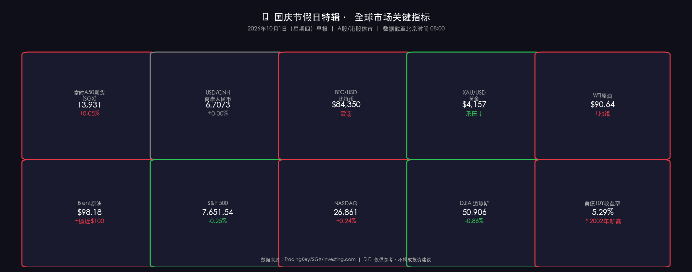

# 🎊 国庆假日特辑：全球市场关键信号｜2026年10月1日早报

**日期：2026年10月01日 (星期四)** &nbsp; **时段：早报（国庆节假日第一天）**

> **核心摘要**：美联储9月全票加息25bp将基准利率推至3.75%–4.00%，美债10年收益率突破5.29%创2002年以来新高，美元走强致黄金承压、Brent原油逼近100美元大关；A股/港股因国庆长假（10月1–7日）休市，SGX富时A50期货温和上涨(+0.05%)显示外资对华敞口情绪平稳；中国三部委节前联合出台"滴灌式"精准宽松政策，市场等待10月8日A股开盘验证政策效果。

---

## 节假日市场概览

> 今日为中国**国庆节假日第一天**（10月1日—7日，共7天），A股（沪深两市）及港股（港交所）全部**休市**。本报告启动 **Holiday Mode（分支A）**，放弃常规行情复盘，转而聚焦：
> 1. **仍在交易的替代指标**（SGX A50期货、离岸人民币、BTC、黄金、原油）
> 2. **美国市场**（昨日9月30日收盘数据）
> 3. **假期宏观热点**（国庆黄金周消费预期 + 政策背景）

**备注**：假期期间 SGX 新加坡交易所 **不停盘**，富时中国A50期货为外资追踪中国市场的核心代理指标。

---

## 替代指标实时监控

### 📌 富时中国A50期货（FTSE China A50 Futures，SGX）

* **合约**：2026年10月合约
* **最新报价**：**13,931 USD**
* **涨跌**：**+0.05%**（+7点）
* **交易状态**：✅ 正常交易（新交所SGX假期不停盘）

> A50期货作为国庆期间境外投资者对冲/建仓中国敞口的核心窗口，持续微涨显示外资整体看多情绪稳定。中国三部委节前的"滴灌式"宽松政策（PSL降息+再贷款扩容）为外资信心提供了政策底支撑。

---

### 📌 离岸人民币（USD/CNH）

* **最新价**：**6.7073**
* **开盘价**：6.7071
* **日内区间**：6.7039 – 6.7087
* **趋势**：窄幅震荡

> 人民币在6.70附近保持高度稳定，但与中信证券预测的6.40–6.60区间上沿接近。假期期间人民币流动性下降，若美元指数进一步走强（美联储加息路径仍存），需警惕离岸人民币被动走弱压力。

---

### 📌 比特币（BTC/USD）

* **最新价（约）**：**~$84,350**
* **日内高点**：$85,600（低通胀数据公布后短暂冲高）
* **近期区间**：$76,000 – $87,000
* **趋势**：低通胀驱动短暂冲高后回落，$84,000附近有支撑

> 9月美国通胀数据低于预期→BTC短暂拉升至$85,500+，但未能突破前高$87,000，显示多头动能受制。高利率环境（美债5.29%）对非利息资产（黄金、BTC）形成持续压制。

---

### 📌 黄金（XAU/USD）

* **最新价**：**$4,156 – $4,157 / 盎司**
* **趋势**：承压下行
* **主要压力因素**：① 美债收益率飙升至5.29%；② 美元指数走强
* **技术面**：呈"卖压主导"熊线结构，在9月28日区间内震荡

> 黄金作为零息资产，在"Higher for Longer"高利率环境中面临机会成本上升的持续压制。但地缘风险溢价（中东紧张局势、美伊谈判停滞）为黄金提供了一定底部支撑，防止大幅破位下行。

---

### 📌 原油（WTI / Brent）

* **WTI（西德州中质油）**：**$90.64 / 桶**（结算约$90.42）
* **Brent（布伦特）**：**$98.18 / 桶**（12月合约$98.03），**逼近$100大关**
* **驱动因素**：① 美伊谈判停滞，霍尔木兹海峡风险溢价上升；② 美国库存数据
* **趋势**：地缘风险溢价支撑，Brent触及$100关口风险加大

> Brent原油逼近$100/桶，将直接推升全球通胀预期，这反过来为美联储"年内再加息一次"的路径提供依据——构成通胀-加息-高利率的负向循环压力。国庆假期期间中国原油需求短暂下降，但地缘风险溢价的驱动力远强于短期需求端变化。

---

**行情数据卡片**

---

## 美国市场收盘复盘（9月30日）

### 📊 三大指数

| 指数 | 收盘点位 | 日涨跌 | 前一交易日收盘 |
|------|----------|--------|----------------|
| **标普500（S&P 500）** | **7,651.54** | **-0.25%** | 7,670.84 |
| **纳斯达克（NASDAQ）** | **26,861.06** | **+0.24%** | 约 26,796 |
| **道琼斯（DJIA）** | **50,906.05** | **-0.86%** | 约 51,346 |

> **数学闭环校验**：S&P 500：(7,651.54 - 7,670.84) / 7,670.84 = **-0.252%** ✅（与报告-0.25%吻合，误差<0.1%）
>
> 道琼斯跌幅-0.86%远大于标普，反映蓝筹防御股估值受高利率拖累明显；科技权重拉动纳指轻微收涨，体现AI盈利预期为科技板块提供相对抗跌支撑。

### 📊 月度/季度背景

* S&P 500 **9月月度跌幅-0.5%**（9月效应延续）
* **年初至今涨幅+11.8%**（截至Q3末）
* **Q3 earnings预期**：S&P 500成分股YoY盈利增速约**23%–28%**，为连续第**8**个季度双位数增长

### 📊 美债10年期收益率

* **收益率（9月30日）**：**5.29%**
* **日内高点**：5.306%
* **历史背景**：**2002年5月以来最高水平**
* **趋势**：持续上行，市场定价"Higher for Longer"

---

## 核心解读与市场逻辑

> **逻辑链条**：
>
> **美联储9月加息25bp**（核心PCE=3.4%，顽固高于2%目标）
> ↓
> **美债10年收益率飙升至5.29%**（2002年以来最高，市场定价"Higher for Longer"）
> ↓
> **美元走强**
> → **黄金（$4,156）承压**（零息资产机会成本上升）
> → **离岸人民币（6.7073）小幅弱化**（接近区间上沿，节后需关注）
> ↓
> **美股分化**：科技盈利预期撑纳指（+0.24%）> 标普（-0.25%）> 道指（-0.86%）
> ↓
> **高收益率环境**：BTC（$84,350）维持震荡，未能突破前高$87,000
>
> **中国三部委9月29日政策组合**（PSL降息+再贷款扩容+首套房补贴）
> ↓
> **SGX A50期货（13,931，+0.05%）**外资对假期政策出台反应温和正面
> ↓
> **国庆消费结构性分化**：出行量创高 vs 人均消费支出谨慎
> ↓
> **市场等待10月8日A股开盘**——验证政策实际落地效果，是本轮中国资产最关键的催化剂节点

**关键风险**：Brent原油若突破$100/桶，将再度推高全球通胀预期，加剧"通胀-加息-高利率"负循环，对全球风险资产构成压力。

---

## 政策脉动

### 🇺🇸 美联储（Fed）：9月FOMC决议（最新）

**FOMC 9月16日会议决议：**

* **决定：加息25bp，联邦基金利率目标区间升至3.75%–4.00%**
* **投票结果**：12–0 全票通过（历史罕见一致性）
* **主席 Kevin Warsh 表态**："通胀居高不下已持续太久，这是不争的事实"
* **核心PCE 2026年中位预测**：**3.4%**（高于2%目标，且预期仍有粘性）
* **点阵图信号**：多数FOMC委员预计年内至少**再加息一次（25bp）**

> **市场最新定价**（截至9月底）：
> * 纽约联储主席 John Williams 9月末表态：**无需急于行动**（暗示10月可跳过）
> * 市场消化路径：**"10月跳过（skip）+ 12月再加息25bp"**
> * 美债10年收益率5.29%（多年高位）充分验证市场对"**Higher for Longer**"的定价

---

### 🇨🇳 中国政策：三部委节前联合宣布"滴灌式"精准宽松

**9月29日三部委联合公告（财政部 + 中国人民银行 + 国家金融监督管理总局）：**

| 政策工具 | 内容 |
|----------|------|
| **首套房利率补贴** | 符合条件首套房买家可获**1%利率补贴**（限贷款≤100万元、房价≤150万元、面积≤120㎡），**自10月1日起生效**，暂定一年 |
| **PSL降息** | 一年期抵押补充贷款（PSL）利率降**25bp**至**1.5%**，适用范围扩大至水网/电网/算力/通信/物流等**新基建**领域 |
| **科技创新再贷款扩容** | 额度增加2000亿元，总规模升至**1.4万亿元** |
| **涉农及小微再贷款扩容** | 额度增加5000亿元，总规模升至**4.85万亿元** |
| **民营企业再贷款扩容** | 额度增加3000亿元，总规模升至**1.3万亿元** |

> **政策定性**：精准定向宽松（"滴灌式"），非"大水漫灌"——央行刻意控制货币乘数效应，避免资产泡沫复燃。财政+货币工具协调出手，同时支撑居民资产负债表（房贷）与实体经济（再贷款），体现政策紧迫感升温但仍保持克制。
>
> **政策背景**：GDP增速有软化至4.5%–5%目标区间下沿的风险；房地产压制仍是最大结构性挑战。本次政策组合重在推动结构转型——去房产化，向科技/消费/创新领域倾斜，体现"五年计划"科技自立的顶层设计意志。

---

## 最新机构观点

### 🏦 高盛（Goldman Sachs）

* **评级**：中国A股/港股 **超配（Overweight）** ✅
* **GDP预测**：2026年实际GDP增长 **4.8%**（高于市场一致预期4.5%）
* **驱动逻辑**：
  * ① 出口增长强劲（预计年增**5–6%**）
  * ② AI应用周期深化，科技板块盈利驱动
  * ③ 中国企业"出海"策略加速（去美化，进入欧洲/东南亚市场）
* **风险提示**：2026年回报将"**更费力**"——从估值重评阶段转向盈利驱动阶段，波动性降低但板块/个股分化加剧
* **房地产**：认为拖累效应将**边际减弱**，不再是系统性风险

---

### 🏦 摩根士丹利（Morgan Stanley）

* **评级**：中性/温和乐观，预期**个位数上涨空间**
* **策略**：从宽基指数押注转向**自下而上选股（bottom-up）**，主动择优
* **核心主题**：
  * ① **科技自立**：五年计划驱动的创新科技股（半导体/AI/高端制造）
  * ② **高股息防御股**：应对楼市拖累带来的持续市场波动
* **房地产**：预计2026年全年**继续温和下跌**，维持谨慎
* **政策研判**：认为中国政策以"**防风险**"为主而非激进增长刺激，市场需主题化而非趋势性布局

---

### 🏦 中信证券（CITIC Securities）

* **会议背景**：第33届中信证券国际投资者策略大会（9月21–24日，香港）
* **核心判断**：
  * 中国经济复苏脉络逐渐清晰，预计全年增长目标可完成
  * **三大投资主题**：**AI驱动新产业周期**、**中国新经济增长引擎**、**全球资本市场重构**
  * ⚠️ 全球AI相关股票**估值泡沫化风险**需警惕（美股AI估值偏高）
  * **人民币汇率**预计稳定在6.40–6.60区间运行
* **政策关注**：重点跟踪**政治局会议**后财政/货币政策落地速度与执行力度

---

### 🏦 中金公司（CICC）

* **当前战略重点**：人民币国际化、跨境市场准入、金融基础设施建设
* **业务布局**：持续深化"全服务"证券平台模式，重点方向：
  * **股权**（AI/新能源主题）
  * **固收FICC**（利率/信用/大宗衍生品）
  * **财富管理**及境内外并购顾问
* **前瞻**：中金2027年资本市场战略大会预计于**2026年11月**召开，届时将发布完整Q4策略及年度展望

---

## 🇨🇳 黄金周消费展望

### 假期安排与出行特征

> 中秋（9月25日）与国庆仅隔3个工作日，大量民众选择"**请3休13**"的拼假模式，实际假期近**两周**，出行半径显著拉长，形成近年来最长的国庆旅游窗口之一。

### 消费结构特征

* **K型消费格局**：出行人次预计创新高，但**人均消费支出谨慎**，性价比导向明显——高端消费与平价消费"两极分化"
* **出境游强势回暖**：意大利、法国、新西兰、澳大利亚、韩国、新加坡等地备受青睐；**多国联游产品**成新潮流
* **"奔县深度游"兴起**：游客偏好在小众城市深度停留（1-3天/地），避开打卡式旅游，追求在地文化体验
* **大宗消费承压**：受楼市低迷及消费信心不足影响，家电等大宗促销意愿减弱，市场以**存量竞争**为主
* **政府补贴托底**：文旅部开展"全国国庆文化和旅游消费月"，各地发放超**3.1亿元消费补贴**激活市场

### 行业预期

* 旅游、餐饮行业客流预期乐观；**香港业界预计国庆餐饮营业额升幅5%–10%**
* 分析师警示：**高出行量 ≠ 高人均消费增长**，文旅总收益提升面临挑战
* 消费逻辑已从"**流量驱动**"转向"**质量与体验驱动**"，通缩压力下民众精打细算

> **宏观含义**：国庆消费数据将成为判断中国内需底部是否夯实的关键观察窗口。若实际消费额（尤其餐饮+住宿）超预期，将增强市场对10月8日A股开盘走强的信心。

---

## 今日市场情绪：高压天平，节日微光

> Prompt: A colossal golden oil barrel stands at the center, balanced on a tightrope above a turbulent sea of red K-line candles. On one side, the US Federal Reserve building glows with blinding white light, while on the other side, a festive red lantern representing China's National Day floats gently in the breeze. The sky is split: half filled with soaring eagle feathers (USD strength), half with colorful fireworks. In the background, a digital ticker shows Brent crude approaching 100 dollars per barrel

---

*免责声明：本报告内容仅供参考，不构成任何投资建议。市场有风险，投资需谨慎。*
