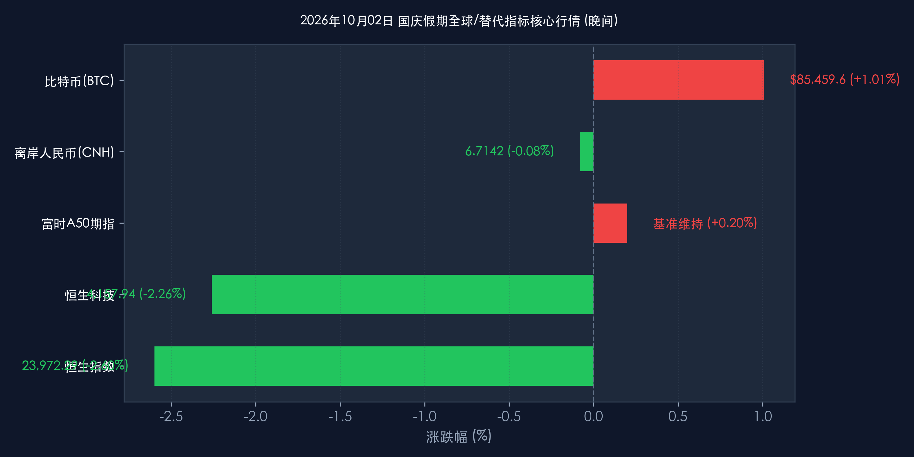

# 2026年10月02日 每日金融市场晚报 (十一国庆专刊)

**日期：2026年10月02日 (星期五)** &nbsp; **时段：16:30 晚间收盘**

> **核心摘要**：2026年国庆长假进入第二日，国内A股继续休市，港股市场受外围美债收益率上升及资金获利回吐打压呈现回调，恒生指数大跌2.60%失守24000点关口。与此同时，国内“请3休13”拼假模式带动超长黄金周服务型消费热潮；离岸人民币与A50期指走势平稳，顶级机构对节后资金回流反弹行情保持乐观。

---

## 核心行情复盘

*   **A股市场**：**休市**。2026年国庆节假期为10月1日（星期四）至10月7日（星期三），A股市场全天休市，10月8日（星期四）起恢复正常交易。
*   **港股市场**：**三大指数集体深幅回调**。恒生指数收盘大跌 **640.98点**（跌幅 **2.60%**），报 **23,972.29点**，失守24,000点大关，创近6个月最大单日跌幅；恒生科技指数收盘下跌 **95.95点**（跌幅 **2.26%**），报 **4,157.94点**，创两年新低。
*   **富时中国A50期指**：**窄幅震荡**。早盘小幅上涨 **0.20%**，在南向资金与国内大盘休市背景下交投相对平淡。
*   **离岸人民币 (CNH)**：**小幅走弱**。离岸人民币兑美元报 **6.7142元**，较前一交易日下跌 **54点**（跌幅 **0.08%**），在 6.7082-6.7222 区间内保持双向波动。
*   **加密资产 (BTC)**：**震荡走高**。比特币现货报 **85,459.60美元**（上涨 **1.01%**），受到机构现货 ETF 配置持续流入及花旗银行上调目标价的提振。
*   **大宗商品 (原油)**：**显著承压**。布伦特原油期货盘中下跌超过 **2.50%**，主因中东出口流量恢复预期及全球战略石油储备释放消息引发供需重估。

> **板块分析**：港股盘面上，科技巨头与金融股领跌，腾讯、阿里巴巴、小米普遍承压；汇丰控股与友邦保险等金融权重回落明显。港股通服务因A股休市暂停，缺乏南向资金承接力，在外围美债收益率上升的背景下流动性收紧。

---

## 核心解读与市场逻辑

> **外围压力与假期效应交织**：10月2日港股深幅调整主要受海外因素拖累。随着美国国债收益率再度走高，全球权益类资产估值普遍承压。加之国庆黄金周期间港股通暂停，缺少内资买盘支持，港股市场易受外围短线资金情绪波动的放大影响。

> **黄金周消费：拼假模式激活深度体验游**：2026年中秋与国庆假期相近，大量民众采取“请3休13”拼假策略，构建了长达13天的超长假日窗口。旅游数据呈现三大特征：
> 1. **长线游与出境游领跑**：1200公里以上的长线游订单显著增多，欧洲、澳洲等长线出境游强劲复苏。
> 2. **服务型消费替代商品消费**：消费重心从实体商品转向沉浸式文化体验、民俗、演出与夜间经济，“附近玩”等微度假走热。
> 3. **理性高性价比导向**：消费者在体验上更加追求“花钱获得感”，驱动文旅商家提升服务品质而非盲目提价。

---

## 政策脉动

> **文旅部“2026全国国庆文化和旅游消费月”全面启动**：官方在9月下旬部署多项促消费举措，各地通过发放专项消费券、推行AI智慧导览、拓展夜间沉浸式演艺等精细化运营手段，直接拉动交通、住宿及餐饮消费。

> **央行与外汇局稳汇率信号明确**：离岸人民币在 6.71 附近维持平稳盘整，政策层持续保持汇率基本稳定预期，确保长假期间跨境资金流动整体可控。

---

## 最新机构观点

> **中信证券**：
> * **消费视角**：“请3休13”长假模式极大地带动了出游需求，并促使消费向目的地及服务型消费倾斜。建议关注发力礼品营销的美妆品牌及假期间高景气的医美机构。
> * **市场策略**：对节后A股行情持乐观态度，建议投资者“持股过节”，重点聚焦“AI+能源化工”等高确定性主线。

> **中金公司**：
> * **国庆效应与资金回流**：节前市场缩量盘整符合历史规律，随着长假后资金重新归位，市场有望迎来流动性修复与反弹行情。

> **高盛 (Goldman Sachs)**：
> * **机构资金布局逻辑**：海外波动短期扰动情绪，但中长期资金（如大型公募与自营资金）关注核心产业趋势与估值性价比，并未出现趋势性离场，回调阶段反而为长线资金提供了布局机会。

---

## 今日市场情绪：长假休市下的港股阵痛与资金观望

> Prompt: A human trader standing on a serene harbor dock decorated with festive red lanterns during Golden Week, holding a tablet displaying HK stock market candlestick charts and offshore RMB exchange rates, digital financial data floating in the night sky, high resolution

---

*免责声明：内容仅供参考，不构成投资建议。*
