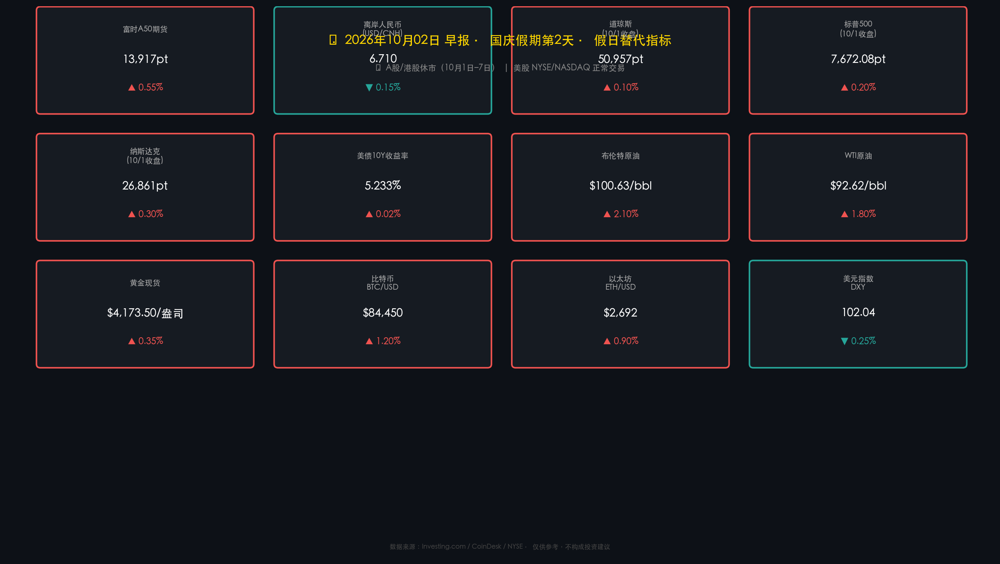

# 🎊 全球金融早报 · 国庆黄金周特辑

**日期：2026年10月02日 (星期五)** &nbsp; **时段：早报**

> **核心摘要**：布伦特原油突破 **$100/桶** 关口，能源通胀压力骤升，叠加美债10年期收益率高位运行（5.233%），全球流动性收紧压力持续；美股三大指数10月1日收小幅反弹，科技股韧性支撑，道指 +0.10%、标普 +0.20%、纳指 +0.30%；国庆黄金周（国庆+中秋叠加）出行量预期创历史纪录，消费呈K型分化，机构静候10月下旬五中全会政策催化。

---

## 假期市场速览（国庆第2天）

> ⚠ **A股/港股休市（10月1日–7日）**，以下为国际替代指标，反映离岸市场对节后A股情绪的隐性定价。

* **富时中国A50期货**：区间 **13,894 – 13,939 pt**，交投清淡，整体呈温和乐观倾向，预示节后开市存在修复性反弹预期
* **离岸人民币 USD/CNH**：约 **6.71**（区间 6.705 – 6.722），人民币偏强运行，资本流出压力明显减弱，这是近期最积极的信号之一

> **解读**：CNH走强至6.71，意味着离岸市场对中国资产的信心在边际修复。A50期货横盘偏强，未出现明显抛压，结合机构对节后"日历效应反弹"的普遍预期，10月8日A股开盘情绪总体谨慎乐观，但需高度警惕国庆期间海外市场（尤其是能源通胀、美债走势）的扰动。

---

## 海外行情复盘

### 🇺🇸 美股三大指数（10月1日收盘终值）

* **道琼斯工业指数**：**50,957 点**，涨幅 **+0.10%**
* **标普500**：**7,672.08 点**，涨幅 **+0.20%**
* **纳斯达克综合**：**26,861.06 点**，涨幅 **+0.30%**

> **背景解读**：美股在国债收益率上行压力下仍收小幅反弹，科技股领涨，整体呈"慢牛"格局。成交量偏低，市场情绪以观望为主。科技龙头的韧性成为支撑大盘的核心力量，但高利率环境对估值的压制不可忽视。

### 🏦 债券与汇率

* **美国10年期国债收益率**：**5.233%**，高位运行；9月末一度触及5.29%后小幅回落，仍处历史高位区间
* **美元指数 DXY**：**102.04**，美元走弱，非美货币获得喘息空间

> **逻辑链**：通胀黏性 → 美债收益率维持5.2%+ → 对美股估值形成压制 → 但科技股盈利韧性强，形成内部分化 → 美元走弱则为新兴市场提供短暂喘息。10年期收益率能否在5.3%以下企稳，是未来数周最关键的技术观察位。

### ⚡ 大宗商品

* **布伦特原油**：**$100.63/桶**，**突破百元关口**，为本期最核心风险信号
* **WTI原油**：**$92.62/桶**，供需持续偏紧
* **黄金现货**：**$4,173.50/盎司**，高位震荡，避险情绪支撑
* **黄金期货**：**$4,191.05/盎司**

> **能源深度解读**：布伦特原油突破$100是本周最重磅事件之一。供应端，OPEC+自愿减产协议延续，沙特与俄罗斯减产叠加；地缘端，中东局势与乌克兰冲突持续扰动供应预期。需求端，全球经济虽放缓，但航空、运输旺季支撑。**关键风险在于：油价破百 → 通胀预期上修 → Fed鹰派立场坚定 → 全球流动性收紧加剧 → 新兴市场承压**。对美国消费者而言，汽油通胀已形成明显负面效应，叠加5.2%的房贷利率，消费信心承压。

### ₿ 加密货币（10月1日均值）

* **比特币 BTC**：约 **$84,450**，延续9月强势，进入季节性强月（历史上10月为比特币表现较强的月份）
* **以太坊 ETH**：约 **$2,692**

> **加密市场逻辑**：BTC在十月开局表现强劲，机构资金持续流入，部分资金将其视为对冲通胀与法币信用风险的工具。在美债收益率高企但美元走弱的背景下，加密货币在"另类资产"框架下具备一定吸引力。需关注监管动态与宏观流动性变化对加密市场的交叉影响。

---

## 国庆假期宏观热点

### 🏮 超级黄金周：出行数据与消费分析

* **假期性质**：国庆（10月1日）+中秋（9月29日）双节叠加，部分旅行者可连休最长 **13天**
* **出行量预期**：预期破历史纪录，延续后疫情以来的出行热情持续释放态势
* **人均消费额**：整体偏保守，楼市低迷持续抑制家庭资产负债表修复，消费信心尚未完全恢复至疫前水平

> **K型消费分化深度解读**：本次黄金周消费呈现明显的K型分化格局——**高端消费（奢侈品、高端餐饮）明显疲软**，消费者降级意愿增强；而**性价比游、体验游、文化游走强**，"特种兵旅游"、露营、非遗体验等成为增长亮点。出境游方面，东南亚持续受益，**泰国、新加坡、马来西亚**成为最热门目的地，受益于免签政策与相对亲民的物价水平。

* **政策配套**：9月22日启动**国家文旅消费月活动**，持续至10月底，地方政府发放消费券、景区打折等刺激措施密集落地，但对整体消费总量的拉动效果仍待观察

---

## 政策脉动与即将重磅事件

### 🇺🇸 美联储动态

* **当前联邦基金利率**：**3.75%–4.00%**（9月已加息25bp，累计加息历程持续中）
* **10月展望**：市场对10月27-28日 FOMC 会议**倾向跳过（skip）**，不加息概率为主流预期
* **12月展望**：市场对12月是否进行"最后一次加息"存在分歧，取决于通胀数据与就业表现

> **政策逻辑**：通胀黏性（服务业通胀、住房成本）使Fed维持鹰派措辞，但实体经济韧性下降令其态度趋于谨慎。布伦特破百推升能源价格，或延缓通胀回落节奏，令Fed陷入两难——加息压制通胀但伤害经济，不加息则通胀预期失控。

### 📅 重磅事件日历

| 日期 | 事件 | 重要性 |
|------|------|--------|
| 10月3-8日 | Pre-COP31 斐济预备会议 | 🌍 气候政策 |
| 10月8日 | **A股节后开盘** | 🔴 高度关注 |
| 10月12-18日 | IMF/世界银行年会（曼谷） | 🌐 全球宏观 |
| 10月19日 | **中国三季度GDP数据发布** | 🔴 核心数据 |
| 10月26-29日 | **二十届五中全会** | 🔴 政策催化剂 |
| 10月27-28日 | **美联储利率决议**（预期跳过） | 🔴 流动性关键 |

> **重点标注**：五中全会（10月26-29日）是当前A股最重要的政策催化剂预期。会议将讨论2026年经济工作重心，市场关注是否有增量刺激政策出台，尤其是地产托底与消费促进方面。中金、中信等机构均将此列为节后行情的核心观察变量。

---

## 最新机构观点

> **高盛（Goldman Sachs）**：将2026年中国GDP增速预测**下调至4.5%**（原预测区间4.6%–4.8%），强调中国经济呈**K型轨迹**——高端制造、出口导向型AI产业链走强，而地产、消费相关产业持续承压。策略建议：**精选高科技制造/AI基础设施赛道，规避宽基指数**。

> **摩根士丹利（Morgan Stanley）**：已**下调A股/港股目标价**，短期维持审慎立场，警惕地产风险尾部暴露。长期战略层面，坚定看好**工业5.0主题**——AI技术驱动12万亿制造业升级，目标达成时间节点预测至2035年。

> **中信证券 / 中信建投**：节后乐观预期资金回流，预判出现**修复性反弹**，建议投资者适度持股过节。配置策略推荐"**三叉戟**"：① 进攻端：AI/半导体（受益于政策扶持与全球AI资本开支周期）；② 弹性端：有色/能源（受益于布伦特破百、大宗商品景气）；③ 防守端：金融/公用事业红利（高股息防御）。

> **中金公司（CICC）**：节后"**日历效应**"支持反弹，历史统计显示A股国庆节后上涨概率偏高。重点提示：**10月26-29日五中全会**将是最重要的政策信号窗口，是本轮行情能否持续的关键催化剂，建议投资者重点关注会议公报中关于地产、消费刺激及科技自立的政策措辞。

---

## 市场博弈总结

> **核心矛盾**：**美债高收益率（5.2%+）vs 科技股盈利韧性**，形成全球资产定价的主轴博弈。布伦特破百强化鹰派预期，而A50与CNH走强则显示国内离岸资金对节后修复抱有温和乐观态度。
>
> **关键风险路径**：布伦特油价破$100 → 推升全球通胀预期 → Fed鹰派立场难松动 → 全球流动性收紧延续 → 新兴市场汇率与股市承压 → A股节后开盘（10月8日）若海外扰动累积，不排除短期承压。
>
> **乐观路径**：五中全会超预期政策 + 美联储10月跳过加息 + 油价高位回落 → 节后行情出现修复窗口。

---

## 今日市场情绪：油价破百，双刃博弈

> Prompt: A colossal black oil barrel, larger than a skyscraper, shatters the $100 price ceiling and erupts into a dark geyser over a glowing city skyline. In the background, a giant golden balance scale tips precariously — one side holds soaring US Treasury bonds at 5.2%, the other side cradles a festive red lantern symbolizing China's Golden Week holiday. A lone hawk silhouette circles overhead against a stormy amber sky.

---

*免责声明：本报告内容仅供参考，不构成任何投资建议。市场有风险，投资需谨慎。*
