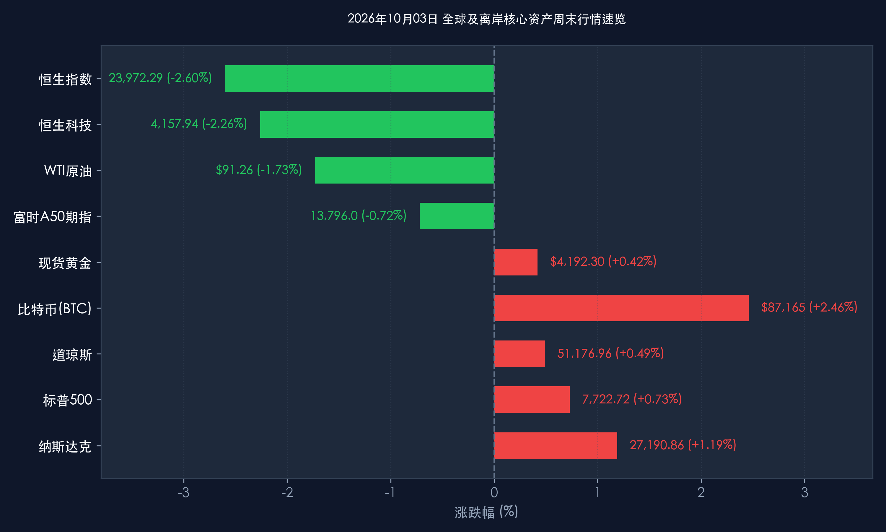

# 2026年10月03日 每日金融市场晚报 (国庆假期·周末大复盘)

**日期：2026年10月03日 (星期六)** &nbsp; **时段：16:30 晚间周末复盘**

> **核心摘要**：2026年国庆长假步入第三天，国内“请3休13”拼假热潮持续引爆全域长线游与服务型消费，全国跨区域人员流动突破21亿人次。海外市场在过去48小时经历剧烈再定价：美国9月非农新增就业仅2.9万人引发就业降温共识，10年期美债收益率自高位骤降至5.217%，美股三大指数周度全线收涨、纳指周涨1.88%；原油因G7释放战略储备及中东情绪缓和大幅降温；A股长假休市期间，离岸人民币与富时A50期货保持区间平稳，顶级机构一致看好节后A股三季报开门红与资金回流修复行情。

---

## 核心资产周度/日度表现回顾

*   **A股市场**：**休市**。2026年国庆节假期为10月1日（星期四）至10月7日（星期三），A股市场全休。节前最后交易周呈现缩量整固特征，上证指数报 **3,882.70点**，全周累计微跌 **-0.45%**，创业板指周度累计上涨 **+0.32%**，资金在长假前维持理性观望，蓄力节后布局。
*   **港股市场**：**周五遭遇外围冲击，全周重心下移**。
    *   **周五单日**：恒生指数深幅下挫 **640.98点（-2.60%）**，收报 **23,972.29点**；恒生科技指数重挫 **95.95点（-2.26%）**，收报 **4,157.94点**。
    *   **全周累计**：恒生指数全周累计下跌 **-3.15%**，恒生科技全周累计下跌 **-3.40%**。受港股通暂停导致内资南向买盘缺席、叠加海外长端利率震荡影响，科技龙头与金融权重短期承压明显。
*   **美股市场**：**周五全面反弹，全周高位攀升**。
    *   **周五单日**：道琼斯指数涨 **+250.40点（+0.49%）**，报 **51,176.96点**；标普500指数涨 **+56.27点（+0.73%）**，报 **7,722.72点**；纳斯达克综合指数大涨 **+319.27点（+1.19%）**，报 **27,190.86点**。
    *   **全周累计**：道琼斯周涨 **+0.82%**，标普500周涨 **+1.15%**，纳斯达克全周劲升 **+1.88%**，AI半导体与云计算产业链全线领涨。
*   **大宗商品与债券市场**：
    *   **WTI原油**：周五下跌 **-1.73%** 收报 **$91.26/桶**，全周累计下挫 **-2.85%**；布伦特原油回落至92美元下方。
    *   **现货黄金**：周五上涨 **+0.42%** 收报 **$4,192.30/盎司**，全周累计上涨 **+1.05%**，实际利率回落为避险金属提供托底动能。
    *   **美债收益率**：10年期美债收益率周五收报 **5.217%**（单日回落约 **-5.0bp**），从周内高点 5.28% 显著松动。
*   **离岸与替代资产指标**：
    *   **富时中国A50期指**：周五微跌 **-0.72%** 收报 **13,796.0点**，全周振幅收窄，净多头头寸维持高位，海外资金整体呈防守均衡态势。
    *   **离岸人民币 (USD/CNH)**：周五报 **6.7043**，全周稳定在 6.70-6.72 区间，境内外汇储备及政策工具箱预期稳定，资本流动平稳。
    *   **比特币 (BTC)**：周五上行 **+2.46%**，报 **$87,165**，周末维持在87,000美元上方震荡，全周累计上涨超 **+3.5%**。

> **板块逻辑拆解**：本周全球资本市场呈现鲜明的“分化与切换”逻辑。美股受益于非农就业骤降带来的美联储紧缩钝化，估值压力释放，科技成长股成为最大赢家；港股则因假期缺乏南向流动性托底，在获利盘与海外利率余波下被动出清；大宗商品中原油在战略储备释放预期下回落，有效缓解了全球滞胀担忧。

---

## 过去 48 小时重磅事件深度复盘

> **美国9月非农爆冷：劳动力市场确立降温通道**：美国劳工部周五公布数据显示，9月非农就业仅新增 **2.9万人**，大幅不及市场预期的9万人，且8月数据被大幅下修2.9万人，失业率维持在4.2%。这标志着美国劳动市场由高位亢奋进入实质性降温阶段。数据公布后，CME FedWatch 显示美联储10月FOMC会议暂停加息的概率飙升至 **75%以上**，推动全球长端国债利率自多年高位回落。

> **G7协调释放石油储备：能源通胀预期暂获喘息**：七国集团（G7）就联合协调释放战略石油储备（SPR）达成阶段性共识，直接压制了国际油价在中东霍尔木兹海峡地缘扰动下的冲高势头。原油价格周线自高位明显回撤，缓解了全球央行面对的输入型通胀难题，为风险资产估值修复创造了窗口期。

> **十一长假第3天：拼假经济引爆文旅消费新形态**：国内消费市场展现出结构性韧性与新亮点。
> 1. **出行半径空前扩张**：中秋与国庆临近促成“请3休13”超级长假，交通运输部统计跨区域流动突破21.3亿人次，千公里以上长线游（西北、西南等）订单翻倍。
> 2. **服务体验优先**：消费者支出偏好向沉浸式文旅演艺、民俗夜游、优质餐饮倾斜，县域“反向旅游”热度不减，消费性价比与情绪价值成为决策核心。
> 3. **宏观支撑稳固**：文旅部国庆文化和旅游消费月各项政策红包稳健落地，线下商业客流同比保持两位数增幅。

---

## 下周全球宏观大事预警

*   **10月5日-7日：国内长假返程与全国消费总账**
    *   重点监测商务部、文旅部以及国家铁路局发布的黄金周消费、票房及客流最终统计，研判四季度国内内需复苏强弱。
*   **10月6日-8日：IMF 2026年年会重磅报告前瞻**
    *   国际货币基金组织（IMF）将在曼谷年会前夕发布《世界经济展望》（WEO）与《全球金融稳定报告》（GFSR）分析章节，全球经济增长与AI投资泡沫风险将成为热评焦点。
*   **10月8日（周四）：⭐ A股与港股通节后首日恢复开盘**
    *   节后资金回流、三季报业绩预告密集出炉，将检验外围分化与假期消费对A股资产的催化效果。
*   **10月9日-10日：美国9月CPI与初请失业金数据**
    *   10月10日（周五）将公布美国9月CPI通胀报告，这是决定美联储年底政策基准（降息或延长观望）的最关键试金石。

---

## 顶级机构周末策略内参摘要

> **中信证券**：
> * **节后进攻窗口确立**：国庆长假前市场的缩量整固属于典型的长假日前日历效应。三季报窗口开启前后是年内最后一波进攻机会，负面因素已在前期得到充分消化。
> * **推荐“哑铃型”配置策略**：一头积极布局景气度确定性极高的 **AI硬件算力** 与半导体核心资产；另一头配置 **低估值高股息资产**（银行、公用事业及能源化工龙头），兼顾进攻弹性与防御韧性。

> **中金公司**：
> * **流动性共振与修复行情**：海外非农不及预期促使美债利率拐头向下，全球流动性环境边际缓和。节后随着股票账户理财资金归位、南向港股通重新通航，前期调整充分的优质中国权益资产有望迎来流动性驱动的反弹。

> **高盛 (Goldman Sachs) & 摩根士丹利 (Morgan Stanley)**：
> * **全球资产再平衡**：海外机构指出，虽然非农数据疲软短期打压美元走势，但更反映了经济向“软着陆”收敛的健康态势。港股在周五的急跌主要由假期流动性抽离所致，中国资产当前的估值折价已具备显著吸引力，中长期外资配置资金倾向于在四季度择机逢低回补。

---

## 今日市场情绪：长假繁星与天平两端的再平衡

> Prompt: A grand surreal scale of time standing over a luminous harbor city during the Golden Week festival, where floating red lanterns ascend into the twilight sky. On one side of the scale, a glowing feather of employment data balances against a massive golden clock of monetary policy. In the background, holographic financial charts and green rising candlesticks reflect on tranquil waters as bullet trains glide across a bridge, cinematic lighting, ultra-detailed.

---

*免责声明：内容仅供参考，不构成投资建议。*
