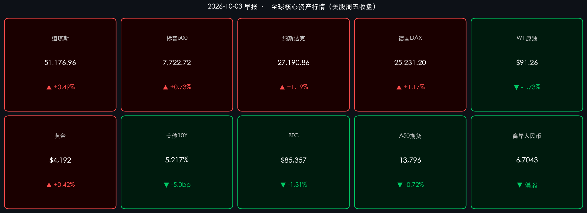

# 🌏 全球金融早报 · 国庆黄金周特辑（第3天）

**日期：2026年10月03日 (星期六)** &nbsp; **时段：早报**

> **核心摘要**：美国9月非农就业仅新增 **2.9万人**，大幅低于预期9万人，为近年最弱劳动数据；市场迅速重新定价——美债10年期收益率从高位骤降至 **5.217%**，美联储10月暂停加息预期显著升温；美股三大指数全线上涨，纳指劲升 **+1.19%**；欧股同步反弹；油价因G7释放储备联合压价下跌 **-1.73%**，布伦特接近 **$91**。A股/港股国庆休市，离岸人民币小幅走弱至 **6.7043**，A50期货下跌 **-0.72%**，节后开盘存在一定压力。

---

## 假期市场速览（国庆第3天）

> ⚠ **A股/港股休市（10月1日–7日）**，以下为国际替代指标，反映离岸市场对节后A股情绪的隐性定价。

* **富时中国A50期货**：收报 **13,796.0 点**，跌幅 **-0.72%**，节假日期间略有走弱，反映海外投资者对全球风险偏好分化、及能源通胀持续的顾虑
* **离岸人民币 USD/CNH**：收报 **6.7043**（日内高位6.7074），较前日呈小幅走软，人民币偏弱运行，节后需关注是否触发汇率防线

> **解读**：A50期货-0.72%的回落表明，海外资金并未在国庆期间显著建仓布局节后开盘，这与全球油价通胀压力及美债收益率高位运行的背景一致。离岸汇率相对稳定（6.70附近），表明资本外流压力总体可控，但弱于昨日6.71的水平，显示一定分歧。机构普遍预期10月8日A股开盘将出现"修复性反弹"，核心逻辑是三季报业绩催化与政策预期，但须高度警惕节假日期间全球市场尤其是能源和美债的扰动传导。

---

## 🇺🇸 美股行情复盘（10月2日 周五收盘终值）

### 三大指数

* **道琼斯工业指数**：**51,176.96 点**，涨 **+250.40点（+0.49%）**
* **标普500指数**：**7,722.72 点**，涨 **+56.27点（+0.73%）**
* **纳斯达克综合**：**27,190.86 点**，涨 **+319.27点（+1.19%）**

> **背景解读**：非农数据的大幅低于预期（仅+2.9万，预期+9万）成为当日最核心交易催化剂。市场的逻辑链条清晰：**弱就业（数据）→ 通胀压力边际减弱（事件）→ 美联储10月暂停加息预期上升（逻辑）→ 美债收益率下行 → 科技估值扩张 → 纳指领涨**。值得注意的是，8月NFP数据也被下修2.9万，进一步强化了"劳动市场已进入降温通道"的叙事。

### 板块表现

* **领涨**：科技（AI算力、半导体）、非必需消费品、通讯服务
* **领跌**：能源板块（受油价下挫拖累）、部分金融股（利差受益预期减弱）

---

## 🌍 欧洲股市复盘（10月2日收盘）

* **德国DAX**：**25,231.20 点**，涨 **+1.17%**
* **法国CAC 40**：**7,897.19 点**，涨 **+0.79%**
* **英国富时100**：**10,461.95 点**，涨 **+0.32%**

> **解读**：欧洲股市与美国联动上行，弱非农数据对全球紧缩预期的降温影响，叠加G7协议释放战略储备压抑能源通胀，改善了欧洲投资者对制造业成本和消费信心的担忧。德国工业权重的DAX涨幅最大。

---

## 📊 大宗商品 & 固定收益

### 大宗商品

* **WTI原油**：**$91.26/桶**，跌 **-1.73%**
  * 下跌驱动：G7成员国达成协议，将协调释放战略石油储备（SPR）以对冲地缘风险（伊朗霍尔木兹海峡局势）带来的供应冲击，市场情绪从"供给冲击恐慌"转向"政策兜底预期"
* **黄金（现货）**：**$4,192.30/盎司**，微涨约 **+0.42%**
  * 非农弱势报告推低实际利率，提升了黄金的相对吸引力，与美债收益率下行形成联动

### 美国国债

* **10年期美债收益率**：**5.217%**，日内跌约 **-5.0bp**（从日高5.264%回落）

> **关键逻辑**：5.217%的收益率水平仍处于历史高位，但弱非农带来的单日骤降 5bp，是市场对"峰值利率已现"的一次重要信号性投票。若12月会议前的数据继续走弱，美债收益率可能形成阶段性顶部，这将对成长股形成结构性支撑。

---

## 💻 加密货币市场

* **比特币 (BTC)**：约 **$85,357**，跌约 **-1.31%**
* **以太坊 (ETH)**：约 **$2,693**，跌约 **-1.5%**

> **解读**：加密市场未能随传统风险资产同步上涨，BTC跌破$86,000关口，显示在美债收益率高位环境下，加密市场的避险属性相对弱势，流动性仍向传统股市倾斜。

---

## 🏛️ 政策脉动

### 美联储（Fed）

* **10月27-28日 FOMC会议**：市场大幅下调10月加息预期。多位联储官员（纽约联储行长约翰·威廉姆斯、副主席杰弗逊）此前已定调"无需急于调整政策"
* **CME FedWatch**：NFP数据发布后，10月暂停加息概率跳升至 **75%以上**，12月成为下一次可能行动的关键时间窗口
* **核心逻辑**：**弱非农（仅+2.9万，失业率4.2%）→ 劳动市场降温证据充分 → Fed可"有充裕时间"观察更多数据 → 10月暂停，年底前是否再加息取决于通胀与就业双数据**

### G7 能源协调

* G7成员国就协调释放战略储备（SPR）达成共识，以对冲伊朗地缘冲突引发的霍尔木兹海峡封锁风险，这是当日油价下跌的直接政策触发因素

---

## 🔍 最新机构观点

**高盛（Goldman Sachs）**：维持对全球经济"韧性增长"的判断（2026年GDP约+2.8%），看好"牛市扩散"趋势，AI算力与数据中心为核心主题。认为本轮非农数据降温属于"软着陆路径"，不改变全年权益资产的正向看法，中期仍超配美股科技+基础设施。

**摩根士丹利（Morgan Stanley）**：维持"建设性但不自满（Constructive, Not Complacent）"立场。倾向于均衡配置美、欧、亚洲权益，而非集中在美股。特别关注大型科技股与商业银行的盈利增长空间；私募市场（PE/私信）已成为投资组合的核心配置层。强调非农后债券利率的下行对高质量成长股有阶段性解压效果，建议逢低布局。

**中信证券**：维持A股"震荡市中修复窗口"判断。国庆节后将迎来三季报密集披露期，这是年内最后一波重要进攻窗口。建议"持股过节"后利用反弹窗口适度调仓；重点配置：① AI+算力（有业绩支撑）；② 创新药/医药（防御底仓）；③ 银行/高股息红利；④ 能源/资源品（景气度+流动性双支撑）。核心风险点：美联储10月会议动向与美债收益率波动。

---

## 📅 下周重磅经济日历（10月5日-10日）

* **10月7日（周二）**：美国8月消费信贷数据
* **10月8日（周三）**：⭐ **A股/港股节后开盘**（节后效应 vs. 海外扰动博弈关键日）；ISM服务业PMI
* **10月9日（周四）**：美国初请失业金人数
* **10月10日（周五）**：美国9月CPI通胀数据（🔑 超级核心数据，决定12月加息路径）

---

## 今日市场情绪：弱非农开锁，科技领涨

> Prompt: A colossal mechanical scale keeper (representing the Federal Reserve) releases a massive golden interest-rate lock into a dark ocean, as waves made of rising green arrows lift a fleet of stock market sailing ships toward a clearing sky. In the background, glowing data charts show 29,000 jobs — far below expectations — dissolving like sea foam, while a pale offshore RMB coin sinks gently beneath the surface. Cinematic lighting, moody atmosphere, ultra-detailed.

---

> **免责声明**：内容仅供参考，不构成投资建议。数据来源：investing.com、tradingeconomics.com、东方财富、Bloomberg等权威渠道，截止时间为2026年10月2日美东市场收盘。
