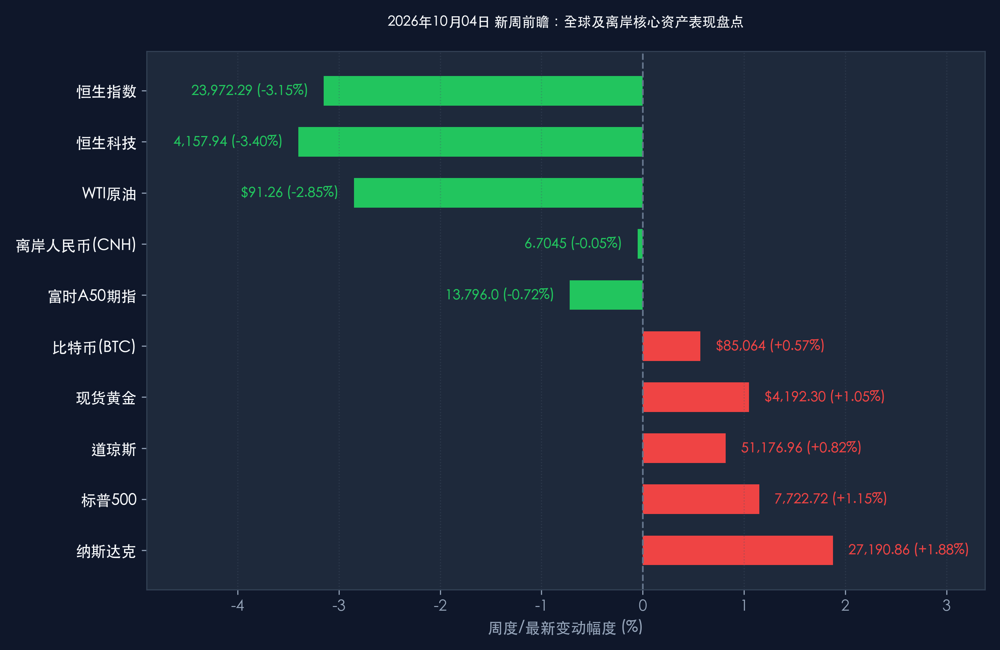

# 2026年10月04日 每日金融市场晚报 (新周展望·黄金周特辑)

**日期：2026年10月04日 (星期日)** &nbsp; **时段：16:30 晚间新周展望**

> **核心摘要**：2026年国庆长假步入第四日，“请3休13”拼假热潮持续释放全域文旅消费势能，全国跨区域人员流动突破21.3亿人次，新能源出行与县域体验游创新高，彰显内需基本盘韧性。海外市场在非农超预期爆冷后确立紧缩降温共识，10年期美债收益率回落至5.217%，美股周线全线收红；新一周全球市场迎来重要开盘窗口：明日（10月5日）港股率先开市打响先锋战，A股蓄力10月8日开门红，顶级机构一致研判节后资金回流与三季报披露将共振开启年内重要进攻窗口。

---

## 周末财经要闻终极汇总

> **十一黄金周出行与消费数据出炉：内需释放结构性亮点**：
> 1. **全域流动规模空前**：根据交通运输部最新监测数据，国庆长假前四天全国跨区域人员流动量保持高位运行，预计七天总量将达 **21.3亿人次**，日均超3亿人次，创历年同期新高。“拼假游”让超1200公里的长线游预订同比增长 **34%**。
> 2. **新能源出行与县域纵深**：全国高速公路充电量峰值突破 **2,804.69万千瓦时**，同比增长超 **60.4%**，展现新能源基础设施与绿色消费的强大驱动；县域小城旅行产品预订同比增长 **42%**，深度游、文旅演艺与特色餐饮成为消费决策核心，居民追求“高质价比”的情绪价值消费趋势确立。
> 3. **政策红利稳健落地**：文旅部国庆文化和旅游消费月各项政策红包（超3.1亿元各地文旅消费券）稳健落地，配合以旧换新补贴政策，为四季度消费回暖筑牢底部支撑。

> **海外宏观环境转向：非农爆冷重塑美联储降息路径**：
> 美国9月非农新增就业仅 **2.9万人**（预期9万人），且前值被大幅下修，失业率企稳于4.2%，印证美国劳动力市场实质性降温。CME FedWatch 显示美联储10月维持利率不变的概率升至 **75%以上**，甚至引发年内重启预防式降息的预期。10年期美债收益率自年内高点显著松动至 **5.217%**（单日下行约 **-5.0bp**），全球长端折现率压力骤降。

> **大宗商品与地缘博弈：战略储备释放有效遏制原油冲高**：
> 七国集团（G7）达成协调释放战略石油储备（SPR）的阶段性方案，国际油价对中东霍尔木兹海峡地缘局势的恐慌情绪明显退潮，WTI原油回落至 **$91.26/桶**（周跌 **-2.85%**），有效阻断了全球滞胀风险的扩散；现货黄金维持在 **$4,192.30/盎司**（周涨 **+1.05%**）高位整固。

---

## 新一周市场核心博弈逻辑

*   **博弈点一：港股明日率先开市，内资缺席下的自主估值修复**：
    *   明日（10月5日，星期一）香港股市正式开盘交易，但**港股通（南向资金）将继续暂停至10月8日恢复**。
    *   上周五港股恒生指数收报 **23,972.29点（-2.60%）**、恒生科技指数报 **4,157.94点（-2.26%）**，短期受内资买盘缺席与获利了结情绪拖累而深幅回调。明日港股将直接对接周末美股大涨、美债利率回落与海外中概股企稳的积极信号，能否在无南向流动性支援下率先完成探底回升，将成为全周离岸中国资产的情绪温度计。
*   **博弈点二：替代资产指标韧性，锁定节后A股三季报开门红**：
    *   **富时中国A50期指**：周五收报 **13,796.0点**，周末维持在13,800点关口附近窄幅整理，空头抛压衰竭，海外资金整体呈防守均衡态势。
    *   **离岸人民币 (USD/CNH)**：维持在 **6.7045** 附近强劲震荡，央行政策工具箱充足，汇率稳定为四季度国内适时降准降息提供了宝贵窗口。
    *   **比特币 (BTC)**：持续在 **$85,064** 附近坚挺运行，全球风险偏好并未因地缘事件出现系统性收缩。
    *   A股市场在国庆节前缩量整固（上证指数 **3,882.70点**），提前完成了假期避险盘出清。随着海外紧缩松动与内需韧性确认，资金已在场外蓄力，节后三季报窗口开启将构成A股最具确定性的进攻契机。

> **核心逻辑推演**：下周宏观与资本市场的主线是“流动性改善对冲外围扰动，业绩验证主导结构性进攻”。前期压制估值的美债利率高位拐头，释放了成长科技赛道的折现压力；而国内长假呈现出的结构性内需繁荣，将有效修复市场对四季度基本面的悲观预期。

---

## 本周重磅经济数据与会议前瞻

*   **10月5日（周一）：港股率先恢复开盘 & 欧美9月服务业PMI终值**
    *   观察港股科技龙头能否在南向资金缺席下迎来空头回补反弹；欧美PMI终值将进一步验证全球经济景气度分化。
*   **10月6日-8日：IMF 2026年年会重磅启幕**
    *   国际货币基金组织将在曼谷召开年会，密集发布《世界经济展望》（WEO）与《全球金融稳定报告》（GFSR），重点关注关于全球软着陆与AI产业链资本开支的专题评述。
*   **10月7日（周三）：国庆长假最后一日 & 全域消费总账出炉**
    *   文旅部、商务部及国铁集团将披露国庆黄金周整体出游、综合消费与票房总账，定调四季度内需底色。
*   **10月8日（周四）：⭐ A股与港股通全面复市 & 节后资金回流检验**
    *   股票账户银证转账恢复通畅，A股迎节后首日交易，三季报业绩预告披露进入高峰期，关注成交额能否迅速重返万亿上方。
*   **10月9日-10日：美联储FOMC会议纪要 & 美国9月CPI报告**
    *   美联储将公布9月议息会议纪要；10月10日（周五）将公布美国9月CPI通胀率（预期同比增长2.8%），作为10月下旬全球资产配置的最核心试金石。

---

## 头部券商/投行开盘策略点睛

> **中信证券**：
> * **节后进攻窗口全面确立**：长假前的缩量整固是典型的假期日历效应，风险已在节前出清完毕。非农爆冷使得美债利率进入下行通道，海外扰动对A股的边际冲击钝化。随着三季报披露窗口开启，市场正迎来年内最确定的配置与进攻阶段。
> * **配置坚定拥抱“哑铃型”策略**：一头积极进攻具备高景气与自主可控逻辑的 **AI算力底座、半导体设备及高端制造**；另一头底仓稳固配置现金流充沛、高股息的 **大型商业银行、公用事业与优质交通运输龙头**。

> **中金公司**：
> * **外围流动性转暖共振，港A两地迎来估值再平衡**：美债10年期收益率自高位松动至5.217%，压制权益资产估值的枷锁松解。尽管明日港股在南向通关闭下面临外资情绪博弈，但超跌后估值优势极为突出；节后随着境内资金归位，港A优质龙头有望迎来流动性与基本面共振的双击修复。

> **华泰证券 & 高盛 (Goldman Sachs)**：
> * **四季度稳增长政策与中国资产全球吸引力**：机构最新研报指出，国庆黄金周消费数据展现出中国内需的强韧底盘，四季度加力落实增量财政与货币政策的预期明确。当前A股与港股的估值折价已达历史极端区间，全球主动型宏观配置基金在四季度逢低回补中国核心资产的动能正在显著增强。

---

## 今日市场情绪：金秋灯火迎先锋，星轨长明候新局

> Prompt: A magnificent celestial lighthouse shaped like an ancient astrolabe standing at the entrance of a glowing oriental harbor during the Golden Week festival. In the sky above, constellations of green financial charts and glowing golden compasses illuminate the twilight sea. In the background, majestic passenger ships and digital fleets navigate peacefully between misty peaks adorned with crimson festival lanterns, cinematic lighting, ultra-detailed, 8k.

---

*免责声明：内容仅供参考，不构成投资建议。*
