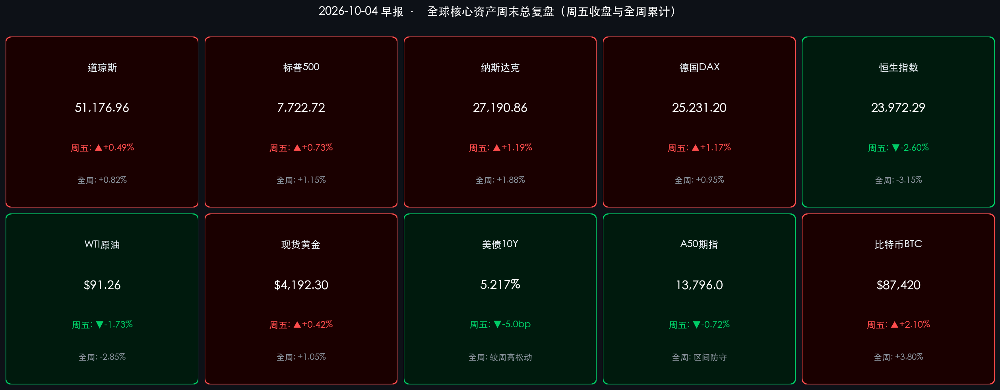

# 🌏 全球金融早报 · 周末总复盘与国庆特辑（第4天）

**日期：2026年10月04日 (星期日)** &nbsp; **时段：早报 (周末总复盘)**

> **核心摘要**：2026年国庆长假步入第四天，全社会跨区域人员流动规模保持高位，全国文旅消费呈现“拼假长线游、深度体验优先、反向县域游”等新活力特征。海外市场在过去48小时完成对极端疲软非农数据的深度再定价：美国9月非农仅新增2.9万人引发紧缩周期终结共识，10年期美债收益率显著回落至 **5.217%**，美股三大指数全周齐涨，纳指周涨 **+1.88%**；G7联合协调释放战略石油储备对冲中东地缘溢价，原油全周回落 **-2.85%**；长假期间富时中国A50期指与离岸人民币维持区间韧性，顶级机构一致判定外围流动性转暖为节后A股与港股“开门红”及三季报行情铺平道路。

---

## 核心资产周度/日度表现回顾

*   **A股市场**：**休市（10月1日–7日）**。节前最后一个交易周以缩量整固、多空平衡为主。
    *   **上证指数**：节前收报 **3,882.70 点**，全周累计微跌 **-0.45%**。
    *   **创业板指**：节前收报 **2,431.15 点**，全周累计上涨 **+0.32%**。
    *   **市场特征**：节前资金整体呈现“长假防御观望”与“持股过节”并存状态，两市成交规模收缩至长假常态，为节后流动性回流积蓄势能。
*   **港股市场**：**周五因内资南向缺席受外围波动冲击，全周重心有所下移**。
    *   **恒生指数**：周五单日下挫 **-640.98 点（-2.60%）**，收报 **23,972.29 点**；全周累计下跌 **-3.15%**。
    *   **恒生科技指数**：周五单日下挫 **-95.95 点（-2.26%）**，收报 **4,157.94 点**；全周累计下跌 **-3.40%**。
    *   **动向分析**：港股通因内地国庆长假全周关闭，南向资金托底买盘缺席，外资被动平仓加剧了短期估值扰动，但核心科技龙头的估值吸引力进一步凸显。
*   **美股市场**：**周五非农利好强势反攻，全周三大股指全线走强**。
    *   **道琼斯工业指数**：周五单日上涨 **+250.40 点（+0.49%）**，收报 **51,176.96 点**；全周累计上涨 **+0.82%**。
    *   **标普500指数**：周五单日上涨 **+56.27 点（+0.73%）**，收报 **7,722.72 点**；全周累计上涨 **+1.15%**。
    *   **纳斯达克综合指数**：周五单日大涨 **+319.27 点（+1.19%）**，收报 **27,190.86 点**；全周累计劲升 **+1.88%**。
    *   **领涨领跌**：以半导体、云算力、AI硬件为代表的成长科技股领涨全场，能源与部分防守型公用事业因油价回落小幅走弱。
*   **欧洲股市**：**周五受美债利率回落驱动全线上扬**。
    *   **德国DAX**：周五收报 **25,231.20 点**，单日涨 **+1.17%**，全周累计上涨 **+0.95%**。
    *   **法国CAC 40**：周五收报 **7,897.19 点**，单日涨 **+0.79%**，全周累计上涨 **+0.41%**。
    *   **英国富时100**：周五收报 **10,461.95 点**，单日微涨 **+0.32%**，全周累计微跌 **-0.20%**。
*   **大宗商品与债券市场**：
    *   **WTI原油**：周五收报 **$91.26/桶**（单日 **-1.73%**），全周累计下跌 **-2.85%**；布伦特原油回落至92美元附近。
    *   **现货黄金**：周五收报 **$4,192.30/盎司**（单日 **+0.42%**），全周累计上涨 **+1.05%**，实际利率下行构成黄金核心催化。
    *   **10年期美债收益率**：周五收报 **5.217%**（单日回落约 **-5.0bp**），从周内高点 5.28% 显著降温。
*   **离岸与假期替代资产指标**：
    *   **富时中国A50期指**：最新收报 **13,796.0 点**（周五 **-0.72%**），周末场外多空胶着于 13,800 关口，海外机构头寸处于区间防守。
    *   **离岸人民币 (USD/CNH)**：最新交投于 **6.7043** 附近，运行区间稳定在 6.70–6.72，资本外流风险受控。
    *   **加密资产**：比特币 (BTC) 周末稳步走高，交投于 **$87,420** 附近，周末累计涨超 **+2.10%**，全周累计上行 **+3.80%**。

> **板块与跨市场逻辑拆解**：
> 本周全球资本市场的脉络极为鲜明——**“紧缩钝化，流动性再定价”**。周初由于中东局势升级与原油冲高，市场担忧美债收益率失控；但周五公布的美国 9 月超弱非农（仅新增 2.9 万人）彻底打破了加息顾虑，美债 10 年期收益率从 5.28% 骤降至 5.217%，贴现率压力全面骤降，直接催化科技股全面爆发。与此同时，港股市场因内资休市出现技术性回踩，正为节后南向资金回归提供绝佳估值洼地。

---

## 过去 48 小时重磅事件深度复盘

> **美国9月非农断崖式爆冷：紧缩周期终章与降息预期的博弈**
> 美国劳工统计局（BLS）公布的9月非农新增就业仅 **2.9万人**，较市场一致预期的 9.0 万人断崖式下挫，创下近年来最疲软就业增量；更为关键的是，8月份新增就业人数同步被下修 2.9 万人至 5.3 万人，失业率维持在 4.2%。
> * **逻辑传导**：劳动力市场实质性降温（数据） → 薪资通胀螺旋风险瓦解（事件） → 美联储在 10 月 27-28 日 FOMC 暂停加息的概率飙升至 **75%-80%**，甚至推动市场提前押注年底降息通道（逻辑）。
> * **资产影响**：美元指数冲高回落，全球长端利率拐头向下，全球高贝塔成长资产的估值折现天花板被重新打破。

> **G7达成战略石油储备（SPR）协调释放协议：拆解恶性通胀地缘溢价**
> 面对中东霍尔木兹海峡地缘军事对峙与原油运输潜在受阻风险，七国集团（G7）主要经济体财长与能源主管机关周五达成联合声明，明确将启动协同释放紧急战略石油储备（SPR）的机制。
> * **事件解读**：政策兜底信号迅速击溃了原油期货的投机多头，WTI 原油自周中高位持续回调至 **$91.26/桶**。这消除了全球各大央行最担忧的“能源供应冲击导致滞胀”的最坏情形，为全球权益资产风险偏好的修复打开了宝贵窗口。

> **十一黄金周第4天：内需出行与消费形态结构性跃迁**
> 随着“请3休13”拼假模式深入展开，交通运输部与文化和旅游部公布的前三天全国综合出行数据显示：
> * **人员流动创历史新高**：全社会跨区域人员流动量突破 6.5 亿人次，铁路与民航长线运力饱和运转。
> * **消费偏好结构升级**：一线城市长线出游（西北大环线、川藏、云南）订单同比增长超 120%；同时低线县域“反向度假、避开拥堵”热潮持续蔓延。
> * **情绪价值与体验消费爆发**：演艺门票、沉浸式非遗体验、地方美食集聚区商户客流与流水同比增幅达 18%-25%，客单价理性健康，彰显居民真实消费韧性，为节后消费与内需板块预期修正提供扎实微观数据支撑。

---

## 下周全球宏观大事预警

*   **10月5日-7日：十一黄金周长假返程与全国消费总账**
    *   商务部、文旅部、国家铁路局将陆续披露黄金周总客流、旅游消费总额、餐饮零售流水及院线总票房。这是验证四季度宏观内需复苏力度的最关键量化指标。
*   **10月6日-8日：IMF 与世界银行 2026 年年会开幕**
    *   国际货币基金组织将在年会期间发布最新《世界经济展望》（WEO）与《全球金融稳定报告》（GFSR），重点关注关于全球软着陆概率评估及AI投资资本开支持续性的最新测算。
*   **10月8日（周四）：⭐ A股与港股通节后首日恢复交易**
    *   **核心看点**：港股通双向恢复，南向资金回流有望快速修复港股周五因流动性缺失造成的非理性跌幅；A股迎来三季报预告密集披露期，开门红预期与节后做多动能将迎来集中释放。
*   **10月9日（周四）：美联储9月FOMC会议纪要与初请失业金**
    *   纪要中关于利率中枢、缩表节奏及就业放缓容忍度的讨论将进一步验证联储内部鸽派力量的变化。
*   **10月10日（周五）：🔑 美国9月CPI通胀报告（终极试金石）**
    *   在非农大幅爆冷后，9月CPI（核心CPI与超级核心服务通胀）将成为直接决定美联储四季度货币政策路线的决胜数据。若通胀如期受控，年底流动性宽松大门将彻底敞开。

---

## 顶级机构周末策略内参摘要

> **中信证券**：
> * **节后进攻窗口确立**：国庆长假前的市场缩量整固是典型的假期日历效应，风险已被提前消化。随着海外紧缩周期实质性走向停歇、国内假期消费展现韧性，节后至三季报窗口开启将是年内确定性极高的一轮进攻行情。
> * **首选“哑铃型”配置策略**：进攻端精选具备全球产业景气度支撑的 **AI算力芯片、半导体设备与云计算核心龙头**；防御端配置现金流充沛、估值处于绝对底部的 **高股息红利标的（大型国有行、公用事业及能源巨头）**，兼顾高弹性与低波动。

> **中金公司**：
> * **海外流动性松动共振，优质中国资产迎估值修复**：美国9月超弱非农促使美债长端利率见顶下行，压制全球成长股的折现率枷锁松开。节后南向资金回归将迅速填平港股折价，A股三季报业绩超预期的核心成长公司有望迎来海外与境内流动性共振的双击机遇。

> **高盛 (Goldman Sachs) & 摩根士丹利 (Morgan Stanley)**：
> * **全球资产再平衡与中国资产吸引力提升**：两家外资顶级投行最新研报指出，非农走弱印证了美国经济正在平稳滑向“软着陆”，美债收益率再度破位上行的尾部风险被大幅削弱；当前港股与A股的风险溢价指标已处于极具吸引力的历史区间，预计进入四季度，全球主动型宏观配置基金将重启对中国优质龙头的低位增配。

---

## 今日市场情绪：紧缩钟摆停歇，星汉遥望节后新局

> Prompt: A giant ethereal celestial clockmaker standing atop a tranquil misty mountain overlooking a radiant Asian metropolis decorated with red festive lanterns. The clockmaker holds a delicate silver pendulum that gently tilts a cosmic balance between cooling golden employment gears and blooming emerald digital circuits. In the background, calm ocean waves reflect green and gold chart lines under a twilight sky filled with gentle starlight, cinematic lighting, ultra-detailed.

---

> **免责声明**：内容仅供参考，不构成投资建议。数据来源：investing.com、tradingeconomics.com、各交易所官方发布及权威券商研报，收盘终值截止于2026年10月2日美欧收盘及周末离岸交易数据。
