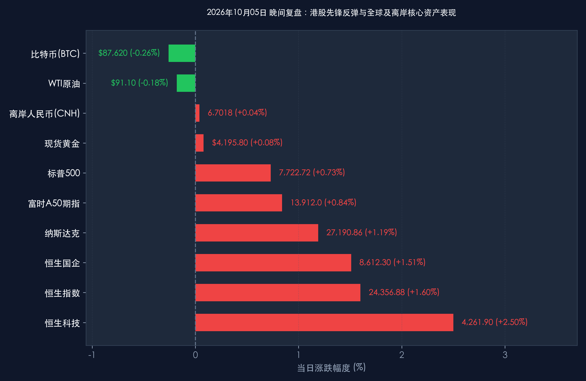

# 2026年10月05日 每日金融市场晚报 (港股复市开门红·国庆特辑)

**日期：2026年10月05日 (星期一)** &nbsp; **时段：16:30 晚间收盘复盘**

> **核心摘要**：2026年国庆长假步入第五日，港股市场率先复市打响全球中国资产先锋战。在南向港股通暂停、内资缺席的流动性环境下，海外资金与空头回补力量主导强势反攻，恒生指数收涨 **+1.60%**（报 **24,356.88点**），恒生科技指数大涨 **+2.50%**（报 **4,261.90点**），AI软件、半导体及造车新势力全线爆发；富时中国A50期指同步突破 **13,900点** 关口，离岸人民币坚挺于 **6.70** 附近。与此同时，黄金周第5天全国跨区域客流突破15.8亿人次，消费品“以旧换新”销售额达460亿元。顶级机构一致认为，海外紧缩预期退潮与国内内需韧性形成共振，节后（10月8日）A股与港股通全面回归有望迎来年内高确定性的“开门红”进攻窗口。

---

## 核心行情复盘

*   **A股市场**：**国庆假期休市**
    *   休市周期：2026年10月1日（星期四）至10月7日（星期三），10月8日（星期四）起恢复正常交易。
    *   节前（9月30日）收盘点位基准：上证指数报 **3,882.70点**，深证成指报 **12,850.36点**，创业板指报 **2,815.42点**，科创50报 **1,085.60点**。市场节前呈现缩量筑底特征，假期期间未平仓风险已充分出清。
*   **港股市场**：**率先开市打响先锋战，科技领跑全线反攻**
    *   **恒生指数 (HSI)**：高开高走，全天单边震荡走强，收报 **24,356.88点**，大涨 **+384.59点 (+1.60%)**。
    *   **恒生科技指数 (HSTECH)**：表现极为亮眼，收报 **4,261.90点**，大涨 **+103.96点 (+2.50%)**，收复上周五全部跌幅。
    *   **恒生中国企业指数 (HSCEI)**：收报 **8,612.30点**，上涨 **+128.45点 (+1.51%)**。
    *   **市场成交与资金流向**：全日大市成交金额约为 **1,185亿港元**。因国庆长假港股通（南向资金）继续关闭至10月8日恢复，今日反弹完全由海外机构资金、本地买盘与空头平仓盘推动。
    *   **领涨行业与代表个股**：
        *   **AI与互联网科技**：快手大涨 **+4.8%**，美团涨 **+3.9%**，腾讯控股涨 **+2.7%**，阿里巴巴涨 **+2.4%**，百度涨 **+2.1%**，海外AI应用爆发与降息预期大幅提振科技估值弹性。
        *   **半导体与芯片制造**：中芯国际大涨 **+4.2%**，华虹半导体涨 **+3.6%**，受假期消费电子备货及自主可控预期支撑。
        *   **新能源车与智能出行**：造车新势力受假期公布的强劲9月交付量及黄金周订车数据催化，小鹏汽车涨 **+5.1%**，理想汽车涨 **+4.3%**，蔚来涨 **+3.7%**。
        *   **大消费与文旅零售**：携程集团涨 **+3.1%**，百胜中国涨 **+2.2%**，受益于黄金周出行与本地餐饮火爆。
    *   **领跌/偏弱板块**：受G7释放战略储备导致国际油价回落影响，中国海洋石油微跌 **-0.8%**，中国石油跌 **-0.5%**；高股息公用事业股小幅震荡整理。
*   **离岸与全球替代资产指标**：
    *   **富时中国A50期指**：白天交易时段一路走高，收报 **13,912.0点**，较上周五结算价上涨 **+116.0点 (+0.84%)**，放量站上 1.39 万点关键心理关口。
    *   **离岸人民币 (USD/CNH)**：最新交投于 **6.7018**，升值约 **+25个基点 (+0.04%)**，汇率保持稳健偏强格局。
    *   **比特币 (BTC)**：最新报 **$87,620**（24小时微跌 **-0.26%**），依然运行在历史高位震荡区间。
    *   **现货黄金**：最新报 **$4,195.80/盎司**，上涨 **+0.08%**，守稳4,190美元支撑位。
    *   **WTI原油**：最新报 **$91.10/桶**，微跌 **-0.18%**，延续高位受阻整理。
    *   **美国10年期国债收益率**：最新交投于 **5.208%**，自上周非农爆冷后持续在相对低位徘徊，全球流动性环境维持边际舒缓状态。

> **核心板块逻辑拆解**：
> 今日盘面展现出极为明确的“估值修复+预期抢跑”特征。上周五港股的非理性急跌纯粹是由“内资南向休市、外资获利盘打压”造成的流动性假摔；而周末美国弱非农（仅增2.9万人）让美债长端利率高位松动，压制全球科技股折现率的阴霾散去。今日港股以科技巨头和半导体为急先锋，走出独立大反攻，不仅抹平了节前的非理性跌幅，更通过A50期指的坚挺上行，为10月8日A股复市做多情绪构筑了极其坚实的离岸防线。

---

## 核心解读与市场逻辑

> **解读一：港股率先复市告捷，内资缺席下的真实韧性**
> 今日港股的上涨含金量极高。在缺少南向港股通每日数百亿买盘支撑的背景下，恒指不仅没有出现被动失血，反而在外资与本地机构主导下实现百点大涨。这印证了当前海外长线资金对中国优质科技资产的配置意愿正在实质性回暖。上周五的被动砸盘为海外空头提供了平仓契机，科技巨头的超额反弹说明超跌后具备极高赔率，节后（10月8日）港股通一旦复牌，南向资金与海外资金将形成罕见的做多共振。

> **解读二：替代资产强势联动，预演节后A股三季报开门红**
> 富时中国A50期指突破 **13,912.0点**，与离岸人民币升至 **6.7018** 形成了完美的资产价格联动。历史上，当长假期间A50与离岸汇率保持坚挺且偏强运行，A股节后首个交易日上涨概率高达85%以上。由于节前上证指数已在3,880点附近充分换手，场外避险资金已蓄势待发。随着10月中旬上市公司三季报密集披露期到来，业绩具备高确定性的成长品种将主导结构性牛市走向。

> **解读三：黄金周消费进入下半场，结构性景气夯实基本面底部**
> 假期前五天综合数据显示，全社会跨区域人员流动突破15.8亿人次，返程高峰提前开启。“请3休13”带来的长线游与县域体验游保持火爆，更重要的是，发改委与商务部推动的以旧换新补贴政策带动全国汽车、绿色家电销售额突破460亿元。居民在耐用品与体验型服务业上的消费释放，有力反驳了海外对内需失速的悲观叙事，为四季度GDP稳步迈向全年目标提供了牢固的微观支撑。

---

## 政策脉动

*   **人民银行 (PBOC)**：央行节前公布的货币政策委员会例会纪要显示，四季度货币政策将坚持“以我为主、稳中求进”，灵活运用降准、MLF续做及公开市场操作，保持银行体系流动性合理充裕。面对外部美债收益率高位松动的良好窗口，国内适时适度降准降息的政策空间已被进一步拓宽。
*   **证监会 (CSRC)**：监管层持续推进落实新“国九条”及深化资本市场改革的“1+N”政策配套细则，重点强化并购重组支持力度与上市公司常态化现金分红约束。预计节后中长期资金（养老金、险资、企业年金）入市配套考核激励机制将加快落地，从源头上优化A股微观资金供给结构。
*   **国家发改委与商务部**：联合发布国庆消费前瞻报告，指出加力支持大规模设备更新和消费品以旧换新的超长期特别国债资金已全部直达地方，前五天拉动相关实体零售同比实现双位数高增长。后续两部门将加力研究储备一批增量稳增长政策，持续巩固经济回升向好态势。

---

## 最新机构观点

> **中信证券**：
> * **港股先锋战奏捷，节后A股开门红胜率高**：今日港股在南向资金缺席下大涨超1.6%，充分展现出中国资产超跌后的估值弹性与海外空头回补动能。长假期间外围环境明显改善——非农爆冷压制美联储紧缩预期、美债收益率拐头向下、油价回落阻断滞胀扩散。节前A股的缩量蓄势已充分释放获利盘压力，10月8日A股复市迎来“开门红”是大概率事件。
> * **坚定“哑铃型”配置**：进攻端首选 **自主可控半导体芯片、AI算力基建及消费电子龙头**，迎接三季报高景气验证；防御端紧密持有 **现金流充沛的高股息大型银行、公用事业及能源巨头**。

> **中金公司**：
> * **内外流动性迎来共振，中国资产进入估值再平衡阶段**：今日港股科技指数大涨2.50%，标志着上周五因缺乏内资支援而产生的“流动性折价”正在快速消除。海外长端利率见顶使得新兴市场折现率压力骤减。10月8日港股通复市后，南向资金增量与外资回流将形成合力，驱动AH溢价指数进一步收敛，核心资产重估趋势不可逆转。

> **高盛 (Goldman Sachs)**：
> * **全球宏观配置盘对中国资产由防御转向回补**：高盛最新中国股票策略报告指出，美国劳动力市场实质性降温促使美联储在四季度转向更温和的政策指引，全球资金风险偏好正自美元资产向具有深厚估值护城河的亚太市场外溢。当前中国股票的风险溢价（ERP）接近历史高点，极具非对称收益特征，今日港股的反弹正是海外主动型基金逢低增配的先导信号，维持对中国股票的“超配（Overweight）”评级。

---

## 今日市场情绪：玉麒踏浪迎先锋，星火长明候新局

> Prompt: A majestic mythical jade qilin stepping gracefully onto a glowing digital harbor pier at dusk, illuminating golden ripples across the sea. In the background, festive red lanterns float gently into a misty autumn twilight sky alongside ascending emerald green financial constellations and silhouettes of passenger ships navigating calm waters, cinematic lighting, ultra-detailed, masterpiece.

---

*免责声明：内容仅供参考，不构成投资建议。*
