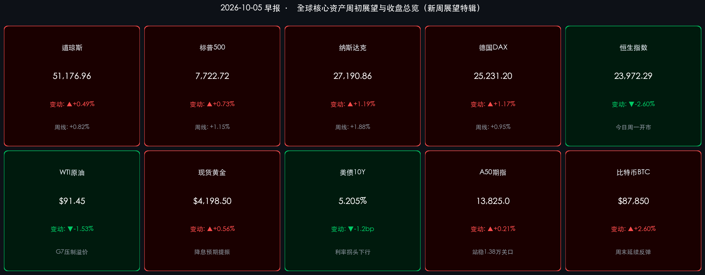

# 🌏 全球金融早报 · 新周展望与国庆特辑（第5天）

**日期：2026年10月05日 (星期一)** &nbsp; **时段：早报 (新周展望 · 假期特辑)**

> **核心摘要**：2026年国庆长假步入第5天，全国跨区域人员流动逼近历史峰值，以“奔县漫游、沉浸体验、品质性价比”为代表的消费结构转型展现微观内需新韧性。海外金融市场在深度消化9月爆冷非农（新增仅2.9万人）后，美债10年期收益率稳步回落至 **5.205%**，降息预期升温驱动全球科技与高贝塔风险资产全面回暖。新一周全球市场将迎来美国9月CPI决胜数据、美联储会议纪要及IMF年会等重磅事件验证；今日港股先行复市（南向资金暂缺），离岸A50期指与人民币汇率坚挺，中信、中金等顶级机构一致预判，外围流动性紧缩终结与节后内资回流共振，为四季度中国核心资产的开门红与进攻反攻创造良好窗口。

---

## 周末财经要闻终极汇总

*   **美国核心股指（上周收盘终值与全周累计）**：
    *   **道琼斯工业指数**：收报 **51,176.96 点**，周五单日上涨 **+250.40 点（+0.49%）**，全周累计上涨 **+0.82%**。
    *   **标普500指数**：收报 **7,722.72 点**，周五单日上涨 **+56.27 点（+0.73%）**，全周累计上涨 **+1.15%**。
    *   **纳斯达克综合指数**：收报 **27,190.86 点**，周五单日大涨 **+319.27 点（+1.19%）**，全周累计上涨 **+1.88%**。
    *   **领涨领跌特征**：半导体算力、云服务巨头领衔反弹，通信设备与消费电子表现强劲；防御性公用事业与传统高位能源股小幅承压。
*   **欧洲核心股市（全周表现）**：
    *   **德国DAX**：收报 **25,231.20 点**，周五涨 **+1.17%**，全周累计涨 **+0.95%**。
    *   **法国CAC 40**：收报 **7,897.19 点**，周五涨 **+0.79%**，全周累计涨 **+0.41%**。
    *   **英国富时100**：收报 **10,461.95 点**，周五微涨 **+0.32%**，全周累计微跌 **-0.20%**。
*   **大宗商品与债券市场（最新与周度）**：
    *   **WTI原油**：最新交投于 **$91.45/桶**，周五收报 **$91.26/桶**（单日 **-1.73%**），全周累计下跌 **-2.85%**；G7联合干预预期抑制了地缘溢价的持续恶化。
    *   **现货黄金**：最新交投于 **$4,198.50/盎司**（周五收报 **$4,192.30/盎司**，单日 **+0.42%**），全周累计上行 **+1.05%**，美债实际收益率回落构成金价高位稳固的坚实底色。
    *   **10年期美债收益率**：最新下行至 **5.205%** 附近，较周五收盘 **5.217%** 续跌约 **-1.2bp**，距周内 5.28% 高点回落超 7bp，紧缩顶部确立。
*   **离岸与假期替代资产最新动向**：
    *   **富时中国A50期指**：最新报 **13,825.0 点**，较周五夜盘回升 **+0.21%**，站稳 13,800 点关口，离岸资金提前对节后复牌展开低位防御性布局。
    *   **离岸人民币 (USD/CNH)**：最新交投于 **6.7018**，走强约 25 个基点，汇率波幅收敛于 6.70–6.71 区间，资本跨境流动预期平稳。
    *   **加密资产**：比特币 (BTC) 周末持续震荡攀升，最新站上 **$87,850**，周末累计涨超 **+2.60%**，突破 $87,000 整数阻力位，凸显流动性宽松预期再定价。
    *   **恒生指数**：今日周一正常开盘交易（上周五收报 **23,972.29 点**，跌 **-2.60%**），虽港股通因内地国庆长假暂缺南向活水，但外围科技股反攻情绪有望带来开盘估值修正。

> **要闻深度拆解一：美国9月非农断崖降温，紧缩终结与降息窗口再定焦**
> 美国劳工统计局上周末披露的 9 月非农仅新增 **2.9万人**（预期 9.0 万人），且 8 月前值由 5.3 万人下修至 2.4 万人，失业率稳于 4.2%。
> * **逻辑链条**：就业增量大幅放缓（数据） → 薪资通胀压力实质性化解（事件） → 美联储 10 月 FOMC 维持利率不变概率攀升至 80% 以上，年底前开启降息讨论的筹码显著增加（逻辑）。
> * **市场反馈**：全球成长资产的折现率压力骤降，美元指数见顶钝化，为新一周全球权益市场风险偏好提升铺垫了温和流动性基础。

> **要闻深度拆解二：G7联合释放战略石油储备（SPR）落地，原油地缘溢价受控**
> 七国集团（G7）主要经济体联合达成的 SPR 协同释放机制进入技术准备阶段，旨在平衡中东霍尔木兹海峡地缘运输风险对全球能源供给的突发冲击。
> * **市场影响**：国际油价自上周突破 $95 的极端恐慌中回落并锁定在 **$91–$92** 区间。有效拆除了困扰全球央行的“滞胀雷区”，使市场无需过度对冲能源引发的二次通胀风险。

> **要闻深度拆解三：国庆黄金周第5天：全社会跨区域流动超预期，消费转型重构逻辑**
> 交通运输部最新综合研判显示，2026年国庆长假前四天全社会跨区域人员流动量已累计突破 **12亿人次**，全周期正稳步迈向预测的 **21.3亿人次** 历史峰值。
> * **微观形态演变**：“请3休13”超级长线游与三四线县域“反向奔县漫游”并行，全国超 3.1 亿元文旅消费券高效撬动文旅流水。虽然人均客单呈现理性特征，但沉浸式非遗、演艺门票和高体验消费增速超过 20%，展现居民内需的深层韧性，打破了节前部分悲观叙事。

---

## 新一周市场核心博弈逻辑

> **博弈主线一：美债贴现率拐点与全球成长资产再估值**
> 10年期美债收益率自 5.28% 峰值回落至 **5.205%**，长端利率见顶信号正在强化。本周全球科技成长的博弈焦点在于：降息预期驱动的“估值扩张”是否能抵消经济微弱放缓带来的“盈利预期调整”。当前以 AI 算力芯片、云计算巨头为核心的高成长资产表现强劲，预示流动性拐点对估值的拉动目前占据绝对主导地位。

> **博弈主线二：港股开市（流动性孤岛效应）与节后两地资产共振前瞻**
> 10月5日–7日期间，港股市场正常开市，但**港股通（南向与北向）双向休市**，港股将处于外资独立定价的短期“流动性孤岛”。
> * **博弈看点**：上周五港股因南向买盘缺席大幅下挫（恒指 -2.60%），今日开盘将受到美股科技股周末大涨的强劲情绪修复；但由于真正的主力内资南向资金需待 **10月8日（周四）** 随 A 股同步复市，港股上半周大概率呈现“低位抗跌筑底、等待南向开闸补血”的节奏。

> **博弈主线三：国内资产节后“三季报+开门红”预备期**
> A股长假前缩量探底，属于经典的“持币避险”长假效应。长假期间外围未出现恶性黑天鹅，相反海外紧缩逻辑松动、汇率平稳、假期消费微观数据良好，为10月8日A股复牌打下扎实心理基础。节后随着三季报业绩预告集中披露，主力资金有望迅速结束观望，向景气度确定的高成长方向与低估值红利底仓加速轮动。

---

## 本周重磅经济数据与会议前瞻

*   **10月5日–7日：十一黄金周返程大考与消费宏观总账披露**
    *   文旅部、商务部、国家铁路局将陆续公布长假客流最终规模、国内旅游收入、餐饮零售与院线票房数据，这是定调四季度内需复苏力度的关键微观指标。
*   **10月6日–8日：IMF 与世界银行 2026 年秋季年会**
    *   IMF 将正式发布 2026 年秋季《世界经济展望》（WEO）与《全球金融稳定报告》（GFSR），重点评估全球通胀退潮路径、降息协同性以及AI产业资本开支的可持续性。
*   **10月8日（周四）：⭐ 中国 A 股恢复交易，港股通双向开闸**
    *   **节后决胜首日**：A股迎来国庆长假后首个交易日，南向资金重返港股。两市流动性大幅回流，国庆积蓄做多情绪与三季报行情的集中发酵成为全市场焦点。
*   **10月9日（周四）：美联储 9 月 FOMC 货币政策会议纪要**
    *   美联储将公布9月利率决议纪要，市场将逐字研读委员们对劳动力市场转冷容忍度、缩表（QT）节奏调整及终极中性利率的推演。
*   **10月10日（周五）：🔑 美国 9 月 CPI 通胀报告（全球超级风暴眼）**
    *   在就业爆冷之后，9月核心CPI（尤其是除住房外的超级核心服务通胀）将成为美联储年内是否启动降息的“终极裁判”。若通胀维持温和回落态势，年底前宽松交易逻辑将被彻底锚定。

---

## 头部券商/投行开盘策略点睛

> **中信证券**：
> * **节后进攻窗口确立，逢低抢跑三季报主线**：长假前的缩量整固是典型的假期日历效应，风险已出清至极低水平。海外非农爆冷扫除加息阴霾、美债长端回落为全球资产松绑，节后内资归场将驱动跨季度行情展开。
> * **“哑铃型”配置仍是最优解**：进攻端精选具备全球产业景气度支撑的 **半导体算力、AI硬件与消费电子核心龙头**；防御底仓重配估值处于绝对底部、股息率超 5.5% 的 **核心国有大行、水电与能源央国企**。

> **中金公司**：
> * **内外流动性共振，中国资产迎重估良机**：10年期美债利率见顶下行有助于缓解新兴市场贴现率压力。港股上周五的被动回调创造了极佳配置窗口，10月8日港股通开通后南向回流有望催化急升反弹；A股三季报业绩确定性高的核心龙头将成为资金回补首选。

> **高盛 (Goldman Sachs) & 摩根士丹利 (Morgan Stanley)**：
> * **全球资产再平衡与四季度中国资产超额收益**：外资顶级投行最新策略指出，非农弱化确认了美国经济正向平稳软着陆过渡，美债收益率失控风险消除；从全球横向估值比价来看，中国资产无论是市盈率分位数还是股权风险溢价（ERP）均极具防守反击优势，四季度全球被动与主动宏观资金对中国资产的再配置需求将显著升温。

---

## 今日市场情绪：金秋潮平两岸阔，新周星火待东风

> Prompt: A mythical celestial golden stag standing calmly atop a serene emerald cliff at sunrise, radiating soft amber light. In the background, below the misty mountain valley, a grand futuristic harbor is adorned with festive red lanterns and glowing digital navigation beams, while the calm jade waters reflect gently rising golden constellations under a twilight sky, cinematic lighting, ultra-detailed.

---

> **免责声明**：内容仅供参考，不构成投资建议。数据来源：investing.com、tradingeconomics.com、各交易所官方发布及权威券商研报，收盘终值截止于2026年10月2日美欧收盘及10月5日早间离岸资产最新数据。
