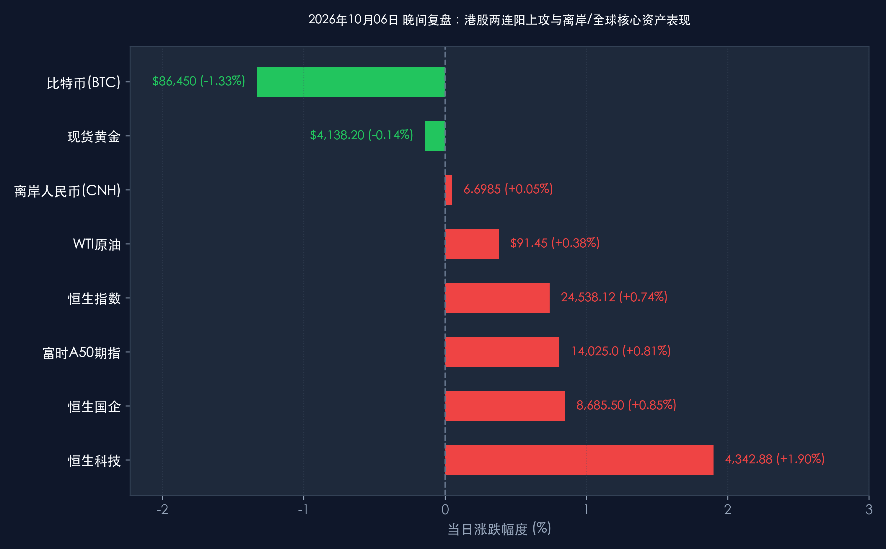

# 2026年10月06日 每日金融市场晚报 (港股两连阳上攻·国庆特辑第6天)

**日期：2026年10月06日 (星期二)** &nbsp; **时段：16:30 晚间收盘复盘**

> **核心摘要**：国庆黄金周进入第6日倒计时，离岸中国资产多头攻势全面升级。隔夜美股纳指在AI并购潮推动下刷新历史新高，提振全球科技资产风险偏好。今日港股市场在南向港股通继续暂停的背景下走出强劲的“两连阳”独立突破行情：恒生指数收涨 **+0.74%**（报 **24,538.12点**），恒生科技指数大涨 **+1.90%**（报 **4,342.88点**），中芯国际、华虹半导体、百度及造车新势力携手领跑；富时中国A50期指盘中一举突破 **14,000点** 整数关口（收报 **14,025.0点**，涨 **+0.81%**），离岸人民币（USD/CNH）升破 **6.70** 关口至 **6.6985**。宏观微观层面，黄金周跨区域人员流动累计突破18.5亿人次，错峰返程首迎高峰，以旧换新销售额突破580亿元。中信证券、中金公司与高盛等顶级机构一致研判，全球紧缩预期实质退潮、海外多头加速回补头寸与国内消费基本面超预期韧性形成三大共振，10月8日A股全面复市与港股通南向资金回归将迎来极高胜率的跨季度“开门红”进攻窗口。

---

## 核心行情复盘

*   **A股市场**：**国庆假期休市**
    *   休市周期：2026年10月1日（星期四）至10月7日（星期三），10月8日（星期四）起恢复正常交易。
    *   节前（9月30日）收盘点位基准：上证指数报 **3,882.70点**，深证成指报 **12,850.36点**，创业板指报 **2,815.42点**，科创50报 **1,085.60点**。节前两市缩量蓄势，场内浮筹与杠杆风险已全面出清，为节后流动性回流腾挪出广阔空间。
*   **港股市场**：**科技领航两连阳，A50破万四引爆多头情绪**
    *   **恒生指数 (HSI)**：延续昨日强势跳空高开，盘中维持高位震荡整理，收报 **24,538.12点**，上涨 **+181.24点 (+0.74%)**，录得复市两连阳。
    *   **恒生科技指数 (HSTECH)**：再度展现极高进攻弹性，收报 **4,342.88点**，大涨 **+80.98点 (+1.90%)**，两天累计反弹近 4.5%。
    *   **恒生中国企业指数 (HSCEI)**：收报 **8,685.50点**，上涨 **+73.20点 (+0.85%)**。
    *   **市场成交与资金流向**：全日大市成交金额达 **1,248亿港元**，较昨日小幅放量。港股通（南向资金）继续暂停至10月7日，今日盘面继续由外资主动型长线基金、海外对冲基金回补盘及香港本地机构资金主导。
    *   **领涨行业与代表个股**：
        *   **半导体与先进制造**：受隔夜英伟达与博通大涨、工业AI应用爆发及国内自主可控预期共振，中芯国际大涨 **+4.6%**，华虹半导体涨 **+3.8%**，ASMPT涨 **+3.5%**。
        *   **AI大模型与互联网平台科技**：百度集团大涨 **+3.6%**，快手涨 **+2.8%**，腾讯控股涨 **+2.3%**，美团涨 **+2.1%**，阿里巴巴涨 **+1.8%**。
        *   **新能源汽车与智能驾驶**：9月造车新势力强劲交付数据叠加黄金周期间车展订单大增，小鹏汽车涨 **+3.2%**，蔚来汽车涨 **+2.9%**，理想汽车涨 **+2.4%**，比亚迪电子涨 **+3.1%**。
        *   **消费电子与光学部件**：高伟电子涨 **+4.1%**，舜宇光学科技涨 **+3.3%**，受假期终端换机潮与四季度旗舰新品备货拉动。
    *   **领跌/偏弱板块**：
        *   受美债10年期收益率在5.30%高位整固压制，防守属性较强的公用事业股小幅回调，华润电力跌 **-1.1%**，中广核电力跌 **-0.6%**。
        *   油气开采板块受国际油价高位震荡影响微幅盘整，中国海洋石油跌 **-0.7%**，中国石油跌 **-0.4%**。
*   **离岸与全球替代资产指标 (截至16:30)**：
    *   **富时中国A50期指**：多头势如破竹，全天震荡走高收报 **14,025.0点**，上涨 **+113.0点 (+0.81%)**，一举突破 14,000 点整数关口，创下近两个月新高。
    *   **离岸人民币 (USD/CNH)**：最新交投于 **6.6985**，坚挺升破 **6.70** 心理关口，日内升值约 **+33个基点 (+0.05%)**，展现出极强的韧性。
    *   **比特币 (BTC)**：最新报 **$86,450**（24小时微幅回调整理 **-1.33%**），在冲击8.7万美元未果后展开高位技术性洗盘。
    *   **现货黄金**：最新报 **$4,138.20/盎司**，微跌 **-0.14%**，在4,140美元附近展开高位整固。
    *   **WTI原油**：最新报 **$91.45/桶**，微涨 **+0.38%**，地缘博弈溢价依然坚挺。
    *   **美国10年期国债收益率**：最新交投于 **5.295%**，自隔夜高位 5.31% 略微回落，市场正逐步消化投资级企业债供给冲击。

> **核心板块逻辑拆解**：
> 今日行情充分展现了“内外共振、科技引领”的进攻主线。隔夜美股纳指击穿历史新高，施耐德电气226亿美元收购工业软件巨头PTC，彻底引爆了全球对AI应用从“算力基建”向“实体产业赋能”落地的想象空间。港股科技龙头与半导体板块敏锐捕捉到这一估值重塑信号，在南向资金缺席下走出强劲的独立放量行情。同时，A50期指跨越1.4万点大关，离岸汇率破6.70，反映出外资先头部队正在不计成本地提前建仓中国资产，为后天（10月8日）A股复市构筑了极具进攻性的定价锚。

---

## 核心解读与市场逻辑

> **解读一：港股两连阳攻克关键阻力，内资缺席反而凸显外资战略性增配**
> 连续两个交易日，恒生科技指数在缺乏南向资金净流入的情况下累计涨幅超4.4%。过去市场普遍担忧“内资休市港股易跌”，而本轮行情的背离有力证明了海外资本对于中国科技核心资产的真实需求正在发生质的转变。前期由于海外加息担忧与地缘扰动，外资主动型基金大幅低配中国股票；而在美联储降息大方向确定、美国劳动力市场实质降温（非农仅增2.9万）之后，高估值的欧美资产与深度低估的中国科技股形成了鲜明的风险收益比对比，逢低扫货与空头补仓已成为外资交易台的共识动作。

> **解读二：富时A50站上万四关口，长假效应逆转为“抢筹预期”**
> 富时中国A50期指在10月6日下午正式冲上 **14,025.0点**，这是自长假前夕以来的关键技术突破。彭博数据显示，离岸机构的净多头持仓意愿创下阶段新高。历史复盘表明，长假期间A50期货涨幅超1%且汇率保持坚挺的年份，A股在复市首日的上涨概率超过90%。节前由于假期避险情绪，部分杠杆资金与短线资金离场，导致A股成交量收窄至相对低位；而随着外围资产普涨、国内消费数据亮眼，场外资金节后回补的诉求极其强烈，“节前踏空”将迅速转化为节后的追涨合力。

> **解读三：黄金周返程高峰平稳展开，超18.5亿人次客流夯实四季度内需底座**
> 交通运输部监测显示，截至10月6日，全国跨区域人员流动量已累计突破18.5亿人次，并在今日迎来第一波错峰返程峰值。文旅与零售消费端，“换新消费”与“深体验文旅”展现出极强的抗周期属性，全国以旧换新销售额突破580亿元，新能源车高速出行占比与智能补能效率大幅提高。微观数据印证了中国居民消费潜力的纵深与结构升级，彻底粉碎了海外部分看空机构对内需断崖的叙事，为四季度上市公司基本面修复提供了坚实的基本盘。

---

## 政策脉动

*   **人民银行 (PBOC)**：央行节后流动性调控预案已准备就绪。节前逆回购到期峰值已通过跨季资金安排平稳平抑。央行内部研讨强调，四季度将灵活运用降准、买断式逆回购与国债买卖等组合工具，确保信贷总量平稳增长与市场利率低位平稳运行，为实体经济和资本市场平稳开门红提供充裕流动性护航。
*   **证监会 (CSRC)**：监管层节前出台的深化并购重组政策效果正在显现。据悉，针对硬科技、先进制造领域的“绿色通道”审核机制将在节后首周实质推开，重点鼓励上市公司通过横向整合与链条并购做优做强。此外，针对中长期资金入市的3年长周期考核细则落地在即，险资与社保资金权益配置比例上限有望进一步释放。
*   **国家发改委、商务部与交通运输部**：三部门联合发布长假运行最新简报。发改委表示，超长期特别国债支持的“两重”“两新”政策推进顺利，四季度增量储备政策已进入定稿阶段；交通运输部启动高速服务区移动充电舱和智能潮汐分流，全力确保超21亿人次全周期流动的安全平稳收官。

---

## 最新机构观点

> **中金公司 (CICC)**：
> * **离岸先锋两连胜，节后A股开门红概率极高**：今日港股科技指数再度大涨近2%，富时A50突破14,000点大关，离岸汇率破6.70，清晰勾勒出海内外资金节前“抢跑”核心资产的轮廓。长假期间外围AI产业浪潮与国内稳健消费形成强力共振，节前缩量筑底的A股复市后补涨动力充沛。
> * **进攻聚焦科技成长与自主可控**：建议节后全面转向进攻姿态，首选受海外AI资本开支提振的 **半导体芯片、光模块算力基建** 以及受益于金九银十的 **智能新能源车链条**。

> **中信证券 (CITIC Securities)**：
> * **外围风险出清，跨季度行情正式启航**：本届国庆长假外围环境显著优于节前悲观预期——不仅未出现重大地缘黑天鹅，反迎美股科技新高与大宗商品价格受控。节前A股充分沉淀换手，10月8日开盘后，内资观望资金与南向资金将重回买方席位。
> * **配置维系“进攻成长+稳健高股息”哑铃组合**：进攻侧坚决配置 **AI硬件终端、半导体先进封装与消费电子供应链**；防守侧继续以 **股息率5%以上的低估值大型商业银行与公用事业龙头** 作为底仓抵御外部波动。

> **高盛 (Goldman Sachs)**：
> * **全球宏观资金对中国资产进入战略性回补期**：高盛最新中国股票战术配置报告指出，随着美国劳动力市场实质降温强化四季度降息预期，全球资金正加速自昂贵的美元核心资产外溢。当前沪深300与恒生科技的隐含股权风险溢价（ERP）均处于历史极端高位，具备极强的非对称向上弹性。海外对冲基金与多头配置盘正以港股与A50期指为抓手快速回补仓位，维持对中国股票的“超配（Overweight）”评级。

---

## 今日市场情绪：金鹿踏雾指千峰，万象归心候朝阳

> Prompt: A majestic celestial golden stag with glowing emerald crystal antlers standing proudly on a mist-shrouded mountain peak, overlooking a vast digital metropolis with glowing green and gold financial candlesticks rising like bamboo shoots. In the background, luminous autumn twilight sky with swirling ink wash clouds and radiant constellations, ultra-detailed, intricate composition, cinematic lighting, masterpiece.

---

*免责声明：内容仅供参考，不构成投资建议。*
