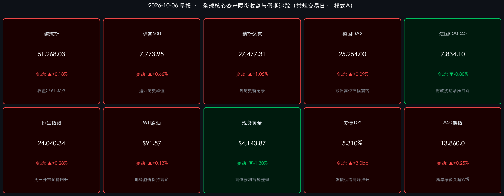

# 🌏 全球金融早报 · 纳指再创新高与国庆长假返程特辑（第6天）

**日期：2026年10月06日 (星期二)** &nbsp; **时段：早报 (常规交易日 · 假期特辑)**

> **核心摘要**：隔夜欧美市场迎来新一周开门红，AI产业驱动的百亿美元级并购浪潮全面引爆市场风险偏好。法国施耐德电气以226亿美元全现金收购工业软件巨头PTC、物流巨头罗宾逊收购RXO，两笔交易均将“AI深度赋能”作为核心驱动，带动英伟达、博通等芯片核心龙头涨超2%，驱动纳斯达克综合指数大涨 **+1.05%** 创下历史新高 **27,477.31 点**，标普500亦逼近历史峰值。尽管因企业债发行供给高峰导致美债10年期收益率短暂冲高至 **5.31%**，但降息周期大逻辑与产业基本面共振成功化解利率扰动。与此同时，中国国庆黄金周进入第6天错峰返程大考，全国高速迎44处重点拥堵路段与服务区充电高峰，微观内需活力保持高位释放。离岸A50期指净多头仓位逼近97%，人民币即期汇率稳居6.70一线，中信、中金与高盛等顶级机构一致指出，外围科技破顶共振与节后内资归场，将为四季度A股与港股核心资产开辟强劲反攻跑道。

---

## 核心行情复盘

*   **美国核心股指（隔夜收盘终值）**：
    *   **纳斯达克综合指数**：收报 **27,477.31 点**，上涨 **+286.45 点（+1.05%）**，刷新历史最高收盘纪录，科技与高成长板块领涨全场。
    *   **标普500指数**：收报 **7,773.95 点**，上涨 **+51.23 点（+0.66%）**，距离历史最高点位不足0.3%，多头动能强劲。
    *   **道琼斯工业指数**：收报 **51,268.03 点**，上涨 **+91.07 点（+0.18%）**，盘中震荡整固，传统周期板块涨幅温和。
*   **领涨领跌行业与异动个股**：
    *   **并购题材与工业软件暴涨**：工业软件巨头 **PTC (PTC.O)** 暴涨 **+33.5%**，受法国施耐德电气（Schneider Electric）226亿美元全现金要约收购刺激；零担货运经纪商 **RXO** 同样因 C.H. Robinson 的收购要约飙升 **+22.5%**。
    *   **AI芯片与算力硬件全线走强**：**英伟达 (NVIDIA)** 收涨 **+2.1%**，**博通 (Broadcom)** 收涨 **+2.1%**，半导体板块成交活跃度显著放大。
    *   **防御板块相对落后**：公用事业、房地产投资信托（REITs）受制于长端国债收益率冲高，表现相对平淡。
*   **欧洲核心股市（隔夜收盘终值）**：
    *   **德国DAX**：收报 **25,254.00 点**，微涨 **+22.80 点（+0.09%）**，制造业与出口类权重股保持韧性。
    *   **法国CAC 40**：收报 **7,834.10 点**，下跌 **-63.09 点（-0.80%）**，国内财政预算谈判与政治不确定性导致本土资金趋于谨慎。
    *   **英国富时100**：收报 **10,481.20 点**，微涨 **+19.25 点（+0.18%）**，能源与防御性医疗保健股提供稳固托底。
*   **大宗商品与债券市场**：
    *   **WTI原油期货**：最新报 **$91.57/桶**，微涨 **+0.13%**（布伦特原油维持在 **$102–$103/桶** 高位），中东霍尔木兹海峡地缘风险溢价仍在持续计价。
    *   **现货黄金**：收报 **$4,143.87/盎司**，回调 **-1.30%**，在前期冲高逼近 $4,200 历史天花板后展开高位技术性获利回吐。
    *   **10年期美债收益率**：报 **5.310%**（上涨约 **+3.0bp**），触及52周高点，主要受新季度初巨额高质量企业债集中发行的挤出效应影响。
*   **亚太与离岸资产最新动向（长假追踪）**：
    *   **恒生指数（周一收盘）**：收报 **24,040.34 点**，反弹 **+68.05 点（+0.28%）**，结束节前单日急跌，科技指数率先止跌回升。
    *   **富时中国A50期指**：最新报 **13,860.0 点**，上涨 **+0.25%**，彭博数据显示离岸净多头持仓比例高达 **97%**，外资提前下注节后复牌走势。
    *   **离岸人民币 (USD/CNH)**：围绕 **6.7050** 窄幅平稳波动，资本跨境预期稳定。
    *   **比特币 (BTC)**：交投于 **$85,500 – $87,000** 区间，隔夜在冲击 $87,000 关键压力位后多空对决加剧，但链上现货持仓稳固。

---

## 核心解读与市场逻辑

> **核心解读一：AI产业资本开支进入“并购整合与应用兑现”新周期**
> 隔夜美股最醒目的催化剂来自两起重磅产业并购：施耐德电气斥资 **226亿美元** 现金收购 PTC，以及物流巨头 C.H. Robinson 吞并 RXO。
> * **逻辑链条**：传统行业巨头现金流充沛（事件） → 亟需通过外部并购快速获取工业AI仿真、数字孪生与算法调度核心能力（动因） → 证明企业界对 AI 的投资已从纯粹的算力基建（GPU）向产业场景落地与工业软件深度渗透（逻辑）。
> * **市场共振**：英伟达与博通双双上涨超2.1%，直接打消了此前部分机构对“AI投资泡沫化见顶”的疑虑，带动纳指率先击穿前高，开启新一轮技术驱动型牛市空间。

> **核心解读二：美债收益率冲高至 5.31% 的本质：发债供给扰动而非通胀恶化**
> 10年期美债收益率隔夜上行3个基点触及 **5.31%** 的年内高位，但并未引发成长股与高估值资产的抛售，呈现出罕见的“股债脱钩”现象。
> * **本质拆解**：本次收益率反弹并非来自通胀预期重新失控，而是由于四季度伊始华尔街投资级企业债（IG Credit）集中挂牌发行，带来阶段性的债券一级市场吸血效应；上周五爆冷的9月非农（仅增2.9万人）已奠定了美联储紧缩周期的实质终结。
> * **资产指引**：只要美联储不再加息，市场便能承受名义无风险利率的高位震荡，股票市场的核心定价权已重新让渡于“盈利增速与产业创新”。

> **核心解读三：国庆黄金周第6天：错峰返程大考展开，微观韧性筑牢四季度内需底色**
> 2026年国庆长假进入尾声，交通运输部与各地交警部门监测显示，全国路网从10月5日下午开始进入分散返程状态，10月6日全国易拥堵高速路段增至44处，超79个高速服务区迎来新能源汽车充电高峰。
> * **微观新特征**：本届长假新能源车渗透率持续提升，车主借助“e路畅通”等数字化工具错峰规划，展现出高效的生活与消费适应能力；同时“奔县游”带来的县域餐饮、沉浸式非遗消费流水呈现20%以上的高增。
> * **资本市场映射**：长假消费数据打破了节前市场的悲观预期，证明居民消费结构在经历由高客单向“高体验、重性价比”转型，内需基本盘韧性充足，为节后消费复苏板块提供了坚实的数据底座。

---

## 政策脉动

*   **美联储货币政策前瞻**：
    *   美联储即将于本周四（10月8日）披露9月FOMC货币政策会议纪要。在劳动力市场明显降温的背景下，市场将重点关注委员们对降息触发条件的表述。当前芝商所（CME）美联储观察工具显示，年内降息一次及以上的概率已重新升至 **75%** 以上。
    *   周五将揭晓的美国9月CPI数据是下阶段全球资产定价的锚。市场预期核心CPI环比增长维持在0.2%的温和区间。
*   **交通运输部与宏观多部委综合研判**：
    *   交通运输部今日清晨发布最新出行研判，预计返程车流峰值将出现在10月7日17时左右。多地交通部门启动智能潮汐车道与服务区快充应急保障，确保全社会超21亿人次跨区域流动的平稳收官。
    *   文旅部、商务部及电影局等部门将于长假结束后集中公布黄金周全景消费总账，四季度宏观增量托底政策的落地节奏将进一步明朗。
*   **离岸金融与汇率管理**：
    *   离岸人民币即期汇率稳定在 **6.7050** 附近，离岸央票与稳汇率政策工具箱储备充裕，跨周期流动性调节使得人民币资产在中东地缘波动与美债利率冲高的外围环境下展现出优异的避险特征。

---

## 最新机构观点

> **中金公司 (CICC)**：
> * **外围新高提供情绪背书，节后开门红概率极大**：隔夜纳斯达克在AI并购大潮下创历史新高，彻底扭转了节前海外市场的防御情绪。恒生指数昨日平稳收复失地，离岸A50期指维持极高多头仓位，充分反映出聪明资金在长假期间的抢跑布局。
> * **节后聚焦双击主线**：10月8日A股复市、港股通重新注入内资增量，建议投资者首选与海外AI产业共振的 **光模块通信、半导体先进封装与AI端侧硬件**，兼顾节后有政策催化的 **自主可控产业链**。

> **中信证券 (CITIC Securities)**：
> * **流动性折价出清，三季报驱动跨季度反弹**：节前国内市场的缩量观望完全是长假避险效应的体现，长假期间不仅外围未现重大利空，反而迎来了海外紧缩预期见顶、AI产业并购提振等多重利好，风险偏好修复空间巨大。
> * **持仓策略保持“进攻+底仓”双轮驱动**：在进攻端积极博弈三季报有望超预期的科技成长细分赛道；在防御端继续压舱 **股息率5%以上的低估值核心央企与大型商业银行**，获取稳定的确定性收益。

> **高盛 (Goldman Sachs)**：
> * **全球资金再平衡加速，中国核心资产极具非对称向上弹性**：高盛最新环球宏观研究指出，随着美国就业走弱推动美联储政策转向，全球被动配置资金开始寻找估值洼地。当前中国沪深300与恒生科技的风险溢价（ERP）均位于过去十年的高分位区间，极具吸引力。一旦节后内资流动性回归，全球多资产宏观基金有望加快对中国资产的仓位回补，维持对中国股票的“超配”建议。

---

## 今日市场情绪：青鸾振翼破重霄，金秋归途汇星芒

> Prompt: A magnificent celestial azure phoenix made of glowing crystal feathers soaring gracefully through radiant golden clouds at daybreak. In the background, expansive rolling autumn landscapes are crisscrossed by luminous glowing transit highways and futuristic fiber-optic viaducts, while high in the deep blue sky, intricate green and golden financial constellation charts pulse with brilliant energy

---

> **免责声明**：内容仅供参考，不构成投资建议。数据来源：investing.com、tradingeconomics.com、各交易所官方发布及权威券商研报，收盘终值截止于2026年10月5日美欧收盘及10月6日早间离岸资产最新数据。
