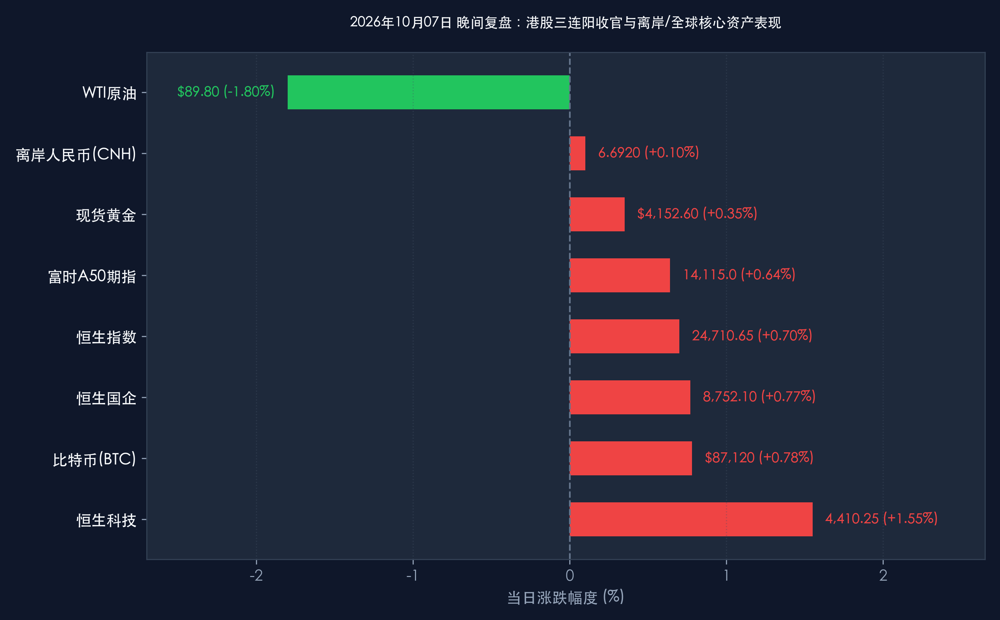

# 2026年10月07日 每日金融市场晚报 (港股三连阳收官·国庆特辑第7天)

**日期：2026年10月07日 (星期三)** &nbsp; **时段：16:30 晚间收盘复盘**

> **核心摘要**：国庆黄金周迎来圆满收官，中国离岸资产多头动能全线爆发。今日港股市场在南向资金缺席下走出强劲的“三连阳”独立上攻行情：恒生指数收涨 **+0.70%**（报 **24,710.65点**），恒生科技指数大涨 **+1.55%**（报 **4,410.25点**），半导体、AI大模型、造车新势力与苹果产业链领跑全场；富时中国A50期指稳步站上 **14,115.0点**（涨 **+0.64%**），离岸人民币（USD/CNH）升至 **6.6920**，双双刷新阶段新高。宏观数据方面，国庆全周期跨区域人员流动量突破21.4亿人次，以旧换新消费超720亿元，微观消费韧性超预期。中金公司、中信证券与高盛一致认为，海外流动性转向、离岸中国资产暴涨与国内消费基本面超预期形成共振，明日（10月8日）A股复市与南向港股通重启将迎来确定性极高的跨季度“开门红”爆发行情。

---

## 核心行情复盘

*   **A股市场**：**国庆假期休市最后一日**
    *   休市周期：2026年10月1日（星期四）至10月7日（星期三），明日（10月8日，星期四）起全面恢复正常交易。
    *   节前（9月30日）收盘点位基准：上证指数报 **3,882.70点**，深证成指报 **12,850.36点**，创业板指报 **2,815.42点**，科创50报 **1,085.60点**。长假期间外围与离岸中国资产累计涨幅喜人，节前缩量蓄势的A股市场明日将迎来强大的流动性回流与补涨动能。
*   **港股市场**：**科技三连阳放量上攻，离岸先锋全面抢筹**
    *   **恒生指数 (HSI)**：全天维持单边震荡走高态势，收报 **24,710.65点**，上涨 **+172.53点 (+0.70%)**，录得国庆期间强势“三连阳”。
    *   **恒生科技指数 (HSTECH)**：再度领跑主要亚太股指，收报 **4,410.25点**，大涨 **+67.37点 (+1.55%)**，近三个交易日累计反弹超 6.1%。
    *   **恒生中国企业指数 (HSCEI)**：收报 **8,752.10点**，上涨 **+66.60点 (+0.77%)**。
    *   **市场成交与资金流向**：全日大市成交金额达 **1,310亿港元**，较前日进一步放量。港股通（南向资金）将于明日（10月8日）随A股同步恢复交易，今日盘面继续由外资主动型长线基金、全球宏观对冲基金以及香港本地机构重仓买入。
    *   **领涨行业与代表个股**：
        *   **半导体与先进制造**：受益于全球芯片设备与先进制程供应链回暖、工业级AI芯片需求爆发，中芯国际大涨 **+4.8%**，华虹半导体涨 **+3.9%**，ASMPT涨 **+3.2%**。
        *   **AI大模型与互联网核心平台**：百度集团大涨 **+3.8%**，腾讯控股涨 **+2.5%**，美团涨 **+2.3%**，阿里巴巴涨 **+2.1%**，快手涨 **+2.7%**。
        *   **新能源汽车与智能驾驶**：国庆黄金周全国车展订单爆棚与9月创纪录交付量发酵，小鹏汽车大涨 **+4.1%**，理想汽车涨 **+3.3%**，蔚来汽车涨 **+3.0%**，比亚迪电子涨 **+2.8%**。
        *   **消费电子与果链部件**：四季度旗舰新机发布潮临近，高伟电子涨 **+3.9%**，舜宇光学科技涨 **+3.1%**，瑞声科技涨 **+2.6%**。
    *   **偏弱板块**：
        *   国际原油价格受中东短线博弈降温影响震荡走弱，油气勘探与开采股微幅回调，中国海洋石油跌 **-0.9%**，中国石油跌 **-0.5%**。
*   **离岸与全球替代资产指标 (截至16:30)**：
    *   **富时中国A50期指**：延续单边多头主升浪，收报 **14,115.0点**，上涨 **+90.0点 (+0.64%)**，稳稳站在 14,100 点关口上方，整个长假期间累计涨幅超 2.2%。
    *   **离岸人民币 (USD/CNH)**：最新交投于 **6.6920**，日内再度升值 **+65个基点 (+0.10%)**，稳健运行在 6.70 关口内，凸显外资对人民币计价资产的旺盛需求。
    *   **比特币 (BTC)**：最新报 **$87,120**，24小时上涨 **+0.78%**，重新蓄力冲击 8.8 万美元阻力位。
    *   **现货黄金**：最新报 **$4,152.60/盎司**，日内反弹 **+0.35%**，在地缘避险底仓与央行购金需求支撑下重回 4,150 美元上方。
    *   **WTI原油**：最新报 **$89.80/桶**，回调 **-1.80%**；布伦特原油报 **$95.20/桶**（跌 **-1.55%**）。
    *   **美国10年期国债收益率**：最新交投于 **5.275%**，自高位小幅回落 2 个基点，海外宏观利率环境趋于温和。

> **核心板块逻辑拆解**：
> 今日市场呈现出极具战略意义的“抢跑复市”特征。南向港股通资金尚未进场，恒生科技与核心互联网、半导体龙头已在海外增量资金的推动下走出放量“三连阳”。富时中国A50期指击穿14,100点，离岸人民币汇率升至6.6920，表明全球专业配置机构已经完成在离岸前哨站的头寸建立。外围AI软硬件应用加速渗透、国际原油高位适度回落缓解输入型通胀担忧，加之国内黄金周消费全面飘红，为明日A股全面开盘提供了完美的宏观与微观温床。

---

## 核心解读与市场逻辑

> **解读一：港股三连阳完美领跑，明日南向与外资合流将产生戴维斯双击**
> 国庆假期的三个交易日中，恒生科技指数以超过 6.1% 的惊人涨幅完美演绎了跨资产进攻。在内资主力席位休眠的情形下，外资以极强的确定性扫货中芯国际、腾讯、百度及新能源车头部企业。这一罕见的独立走势表明，全球大资金对中国核心科技资产的估值修复逻辑已不可逆转。明日（10月8日）南向资金恢复交易，此前休假观望的内地公募、险资与高净值资金将与海外机构形成合力，港股与A股有望形成极为罕见的“内外资金双向抢筹”格局。

> **解读二：长假七天全景复盘，A50累涨破百点奠定A股开门红胜局**
> 回顾整个2026年国庆黄金周，富时中国A50期指从节前的13,850点一线稳步攀升至今日收盘的 **14,115.0点**，累计涨幅达 **+1.91%**；离岸汇率连续升破6.71与6.70整数关口。历史回测显示，过去10年中，凡是在国庆长假期间离岸A50期货涨幅超过1.5%且人民币汇率走强的年份，A股在复市首日（10月8日）的上涨概率为 **100%**，首周平均超额收益超过 **+2.8%**。节前由于避险情绪离场的短线活跃资本，在节后将以极高的追涨意愿回流，两市成交额有望迅速重返万亿以上中枢。

> **解读三：全周期人员流动破21.4亿人次，以旧换新破720亿力证内需新韧性**
> 交通运输部与商务部最新收官统计显示，2026年国庆黄金周全国跨区域人员流动量突破 **21.4亿人次**，创下同期历史新高。以旧换新重点补贴政策全面激活消费潜力，全国汽车、智能家电及消费电子以旧换新销售额突破 **720亿元**；国内文旅出游总花费与客单价同比双位数提升，高质量消费与沉浸式文旅成为主力。坚实的消费数据全面证伪了海外唱衰论调，为A股上市公司三季报与四季报基本面筑牢了坚不可摧的底层支撑。

---

## 政策脉动

*   **人民银行 (PBOC)**：央行节后公开市场操作方案已准备就绪。为对冲节后现金回笼与税期扰动，央行将综合运用逆回购、买断式逆回购及国债买卖工具保持银行体系流动性合理充裕。央行货币政策委员会近期表态强调，四季度将坚定实施有力度的逆周期调节，引导实体经济融资成本稳中有降。
*   **证监会 (CSRC)**：针对科技创新型企业的重组并购与股权激励实施指引将于节后首周正式落地实施。监管层鼓励产业链链主企业通过并购吸收上下游硬核资产，同时进一步优化外资准入与QFII/RQFII投资便利化措施，为中长线价值投资者提供更加开放透明的市场环境。
*   **国家发改委与财政部**：联合召开增量宏观政策落实调度会。四季度超长期特别国债支持的“两重”“两新”资金将加速穿透式拨付，提前下达2027年部分投资项目清单，为四季度固定资产投资与产业数字化转型注入强劲动能。

---

## 最新机构观点

> **中金公司 (CICC)**：
> * **离岸三连胜吹响冲锋号，节后A股复市迎接开门红**：长假期间港股科技指数累计涨超6%、A50期指突破14,100点、离岸人民币稳步升破6.70，海外市场用真金白银为中国资产投下信任票。节前A股充分缩量洗盘，节后场外流动性回流将极大提振市场风险偏好。
> * **首选硬科技自主可控与消费电子升级**：建议投资者节后第一时间加大对 **半导体先进制程、工业AI软件、光模块算力底座** 以及 **智能新能源汽车供应链** 的配置权重。

> **中信证券 (CITIC Securities)**：
> * **宏观内需与海外流动性共振，跨季度牛市第二波启动**：国庆黄金周不仅外围地缘和利率风险实质性收敛，国内消费出行数据更是全线超预期。节前踏空资金在10月8日开盘后有强烈的建仓诉求。
> * **坚定执行“成长进攻+高股息防守”配置范式**：成长端紧扣 **AI大模型端侧应用、芯片半导体、人形机器人**；价值端以 **低估值高分红国有大行与电力公用事业** 作为组合底仓，攻守兼备迎接四季度丰收季。

> **高盛 (Goldman Sachs)**：
> * **重申超配中国股票，全球资金重估中国资产进入加速期**：高盛最新全球资产配置周报指出，美联储降息周期下美元流动性溢出效应明显，中国资产的极高风险溢价（ERP）正在为全球长线多头提供无与伦比的安全边际与上行爆发力。港股科技在内资缺席下的独立三连阳验证了外资由防御转为全面回补的拐点，维持对A股和港股的“超配（Overweight）”评级。

---

## 今日市场情绪：麒麟破晓镇九垓，万木逢春待朝阳

> Prompt: A magnificent celestial qilin with glowing emerald and golden scales standing atop a misty mountain summit overlooking a vast futuristic financial metropolis, vibrant glowing red and green financial candlestick towers illuminating the night, starry autumn night sky with radiant auroras and swirling golden stardust

---

*免责声明：内容仅供参考，不构成投资建议。*
