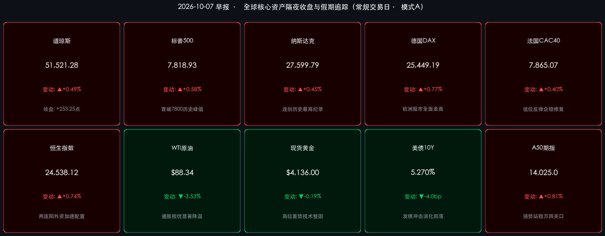

# 🌏 全球金融早报 · 标普首破7800点创历史新高与国庆长假收官前瞻（第7天）

**日期：2026年10月07日 (星期三)** &nbsp; **时段：早报 (常规交易日 · 假期特辑)**

> **核心摘要**：隔夜欧美市场多头动能再度爆发，标普500指数历史上首次突破 **7,800点** 整数大关（收报 **7,818.93点**，涨 **+0.58%**），纳斯达克综合指数连续第二个交易日改写历史最高收盘极值（收报 **27,599.79点**，涨 **+0.45%**），道琼斯工业指数亦稳步上涨超250点。美债10年期收益率在平稳吸收投资级企业债供给高峰后回落4个基点至 **5.27%**，国际油价重挫逾3.5%显著缓解全球通胀反弹担忧，英伟达、AMD及博通等半导体算力龙头持续获得机构高位抢筹。与此同时，中国国庆黄金周进入第7天收官返程终极大考，全社会跨区域人员流动累计预计超21.3亿人次创历史纪录，微观内需与消费韧性全面显现。富时中国A50期指强势站稳 **14,000点** 整数关口，离岸人民币坚挺于6.70以内，中金、中信与高盛等顶级机构一致研判，外围科技新高共振与节前避险出清的充裕流动性将在明日（10月8日）全面迎来回流，A股与港股四季度跨季度“开门红”胜率极高。

---

## 核心行情复盘

*   **美国核心股指（隔夜收盘终值）**：
    *   **标普500指数**：收报 **7,818.93 点**，上涨 **+44.98 点（+0.58%）**，历史上首次有效击穿 7,800 点关键阻力，创下历史收盘新高，广谱成分股全面回暖。
    *   **纳斯达克综合指数**：收报 **27,599.79 点**，上涨 **+122.48 点（+0.45%）**，连创历史最高收盘极值，科技与成长主线动能充沛。
    *   **道琼斯工业指数**：收报 **51,521.28 点**，上涨 **+253.25 点（+0.49%）**，大型工业、金融与消费权重股同步稳步上攻。
*   **领涨领跌行业与异动个股**：
    *   **AI芯片与硬件算力延续攻势**：**超威半导体 (AMD)** 收涨 **+2.4%**，**英伟达 (NVIDIA)** 收涨 **+1.8%**，**博通 (Broadcom)** 收涨 **+1.6%**，华尔街投行普遍对大厂三季报资本开支指引持乐观预期。
    *   **欧洲与跨国工业巨头走强**：受前日施耐德电气226亿美元收购工业软件巨头PTC示范效应持续发酵，软件与工业数字化解决方案标的普遍受资金追捧。
    *   **能源与油气开采承压回落**：国际油价单日大跌超3%，导致埃克森美孚、雪佛龙等能源权重股逆势小幅盘整。
*   **欧洲核心股市（隔夜收盘终值）**：
    *   **德国DAX**：收报 **25,449.19 点**，上涨 **+195.19 点（+0.77%）**，高新技术制造与汽车出口板块表现亮眼。
    *   **法国CAC 40**：收报 **7,865.07 点**，上涨 **+30.97 点（+0.40%）**，走出此前政治与财政预算阴霾，迎来技术性反弹。
    *   **英国富时100**：收报 **10,544.25 点**，上涨 **+63.05 点（+0.60%）**，在公用事业与防御性蓝筹带动下刷新近期高位。
*   **大宗商品与债券市场**：
    *   **WTI原油期货**：收报 **$88.34/桶**，大跌 **-3.23 美元（-3.53%）**（布伦特原油回落至 $100 关口下方），中东霍尔木兹海峡地缘溢价阶段性降温，供给端弹性释放。
    *   **现货黄金**：收报 **$4,136.00/盎司**，微调 **-7.87 美元（-0.19%）**，在前期触及历史顶峰后维持良性高位震荡洗盘。
    *   **10年期美债收益率**：报 **5.270%**（下行约 **-4.0bp**），季度初巨额企业债发行的吸水效应被市场迅速消化，长期无风险利率重回平稳区间。
*   **亚太与离岸资产最新动向（长假追踪）**：
    *   **恒生指数（周二收盘）**：收报 **24,538.12 点**，上涨 **+181.24 点（+0.74%）**，录得两连阳；恒生科技指数大涨 **+1.90%** 领跑亚太，南向资金暂停期间外资做多意图显著。
    *   **富时中国A50期指**：最新交投于 **14,025.0 点** 关口上方，继续保持强势震荡，多头头寸维持历史高位区间。
    *   **离岸人民币 (USD/CNH)**：维持在 **6.6985** 附近强劲位置，稳健站上 6.70 关口以内，结售汇预期良好。
    *   **比特币 (BTC)**：交投于 **$86,000 – $86,500** 区间，隔夜在冲击8.7万美元未果后展开高位技术性洗盘，链上长期持有者筹码稳固。

---

## 核心解读与市场逻辑

> **核心解读一：标普击穿 7,800 历史天花板：降息预期与产业繁荣共铸“金发女孩”行情**
> 隔夜美股最引人注目的里程碑是标普500指数正式站上 **7,818.93点**，标志着美股在消化了高利率扰动后开启新一轮价值重估。
> * **逻辑链条**：9月非农爆冷仅增2.9万（事件） → 奠定美联储紧缩周期彻底终结并打开四季度预防性降息窗口（动因） → 利率锚下行直接推升长久期成长股估值上限（逻辑）。
> * **结构特征**：本轮上涨已从前期的“单纯巨头拉抬”扩展至工业制造、消费科技等更广泛板块，反映出全球机构对经济实现平稳软着陆的信心大幅增强。

> **核心解读二：油价大跌 3.5% 与美债利率回落：击碎输入型二次通胀假象**
> 隔夜国际原油自91美元上方大幅回调至 **$88.34/桶**，布伦特原油亦跌破100美元关口，10年期美债收益率同步回落4个基点至 **5.27%**。
> * **本质拆解**：前期推升美债收益率的“新季度企业债集中发行冲击”已告一段落，而大宗商品的降温则从根本上解除了核心CPI反弹的警报。
> * **资产指引**：输入型通胀压力的消退，使得美联储在10月和11月的货币政策操作空间大为拓宽，为全球权益类资产特别是具备估值洼地特征的新兴市场扫清了外生宏观障碍。

> **核心解读三：国庆黄金周第7天：全周期超21.3亿人次迎收官大考，内需底座支撑明日开市**
> 10月7日为2026年国庆长假最后一天，全国迎来全周期返程绝对最高峰，各大枢纽机场、高铁干线及高速公路全负荷平稳运转。
> * **数据映射**：全周期超21.3亿人次的跨区域人员流动、以旧换新销售额创历史新高、“县域游+深度文化游”双轮爆发，有力验证了居民消费结构调整后展现出的惊人黏性与内生韧性。
> * **节后传导**：长假期间外围未出现黑天鹅事件，反迎美股新高、离岸资产领涨（A50破万四、恒科两日反弹超4%），节前因长假避险而降低仓位的内资主力资金面临强烈的“补票”需求，明日（10月8日）A股开市将迎极具确定性的流动性回流潮。

---

## 政策脉动

*   **美联储货币政策前瞻与全球流动性**：
    *   美联储即将于美东时间周四公布9月FOMC货币政策会议纪要。随着劳动力市场降温得到数据反复印证，市场高度聚焦纪要中关于降息门槛的内部共识。CME利率观察工具显示，四季度累计降息预期维持在50个基点左右的高位，全球美元流动性呈现实质性边际宽松态势。
*   **国家多部委长假收官调度与增量宏观举措**：
    *   交通运输部、公安部与国铁集团于10月7日清晨联合启动返程最高峰应急一级调度方案，全力保障超21.3亿人次长假出行圆满收官。
    *   国家发改委与财政部节后首批增量政策储备已进入落实准备阶段，超长期特别国债与专项债结存限额将加快下达，针对新型基础设施建设与高技术制造的专项支持方案有望在节后首周密集出台。
*   **离岸金融与资本市场准备**：
    *   离岸人民币即期汇率稳居 **6.6985**，央行稳汇率政策预期管理成效卓著；沪深交易所与中国结算各项交易结算系统已完成节前全网测试与例行维护，明日开市交易系统技术保障与流动性供给已全面就绪。

---

## 最新机构观点

> **中金公司 (CICC)**：
> * **外围连创纪录背书，明日A股大概率迎来普涨开门红**：长假期间欧美股市涨声一片，标普首破7,800点、纳指两连新高，港股科技与A50期指率先走出强势进攻姿态。节前A股充分收敛蓄势，场内杠杆出清彻底，节后首日有望实现“高开高走、增量共振”。
> * **重点布局产业景气与自主可控**：明日复市后，建议重点把握三大进攻方向：一是受益于海外AI军备竞赛与大模型端侧落地的 **光通信、算力芯片与先进封装**；二是具备金九银十高景气验证的 **智能电动车核心供应链**；三是有望受益于节后政策密集落地的 **工业母机与半导体设备**。

> **中信证券 (CITIC Securities)**：
> * **跨季度反弹窗口全面打开，三季报将成行情核心分水岭**：海外流动性边际趋松已成定局，国内消费与返程数据打破悲观预期，节前离场观望资金的回流将为四季度行情提供充沛动能。随着上市公司三季报披露即将拉开帷幕，基本面超预期个股将迎来戴维斯双击。
> * **坚守“进攻成长+稳健高股息”哑铃策略**：在进攻端积极博弈三季报有望大幅改善的科技创新赛道；在底仓端继续重配 **股息率5%以上的低估值核心央企与大型商业银行**，以攻守兼备的组合穿越海外宏观利率波动。

> **高盛 (Goldman Sachs)**：
> * **全球资金对中国核心资产的战术性回补正在提速**：高盛最新全球配置策略指出，在美债收益率高位见顶、原油价格重挫消除全球滞胀风险的背景下，全球宏观多资产基金正在加速评估各大市场的风险收益比。当前沪深300与恒生指数的估值折价依然处于历史极值附近，具备极具吸引力的非对称向上弹性。海外离岸资金已率先通过港股和A50期指建立多头敞口，预计节后A股复牌将吸引更多长线主动资金加仓，继续维持对中国股票的“超配（Overweight）”评级。

---

## 今日市场情绪：青龙腾岳迎破晓，万水归川候启新

> Prompt: A colossal mythical celestial dragon woven from luminous emerald and golden aurora borealis coiling majestically around a towering crystalline peak reaching toward the heavens. In the background, sprawling misty autumn valleys below are traversed by shimmering golden transit routes, while constellations of glowing emerald financial indices light up the pre-dawn sapphire sky.

---

> **免责声明**：内容仅供参考，不构成投资建议。数据来源：investing.com、tradingeconomics.com、各交易所官方发布及权威券商研报，收盘终值截止于2026年10月6日美欧收盘及10月7日早间离岸资产最新数据。
