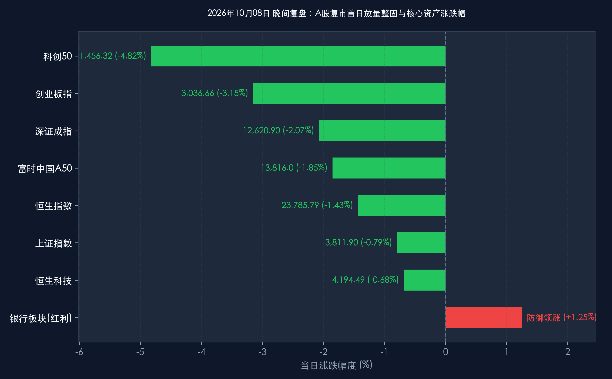

# 2026年10月08日 每日金融市场晚报 (节后首日放量博弈·科技承压红利护盘)

**日期：2026年10月08日 (星期四)** &nbsp; **时段：16:30 晚间收盘复盘**

> **核心摘要**：2026年国庆长假后首个交易日，A股市场迎来预期分歧与高位获利盘集中兑现的深度博弈。三大指数早盘冲高回落后全天维持震荡调整态势，上证指数跌 **-0.79%**（收报 **3,811.90点**），深证成指跌 **-2.07%**（收报 **12,620.90点**），创业板指跌 **-3.15%**（收报 **3,036.66点**），科创50重挫 **-4.82%**（收报 **1,456.32点**）。两市全天成交额达 **1.68万亿元**，较节前显著放量 **2,441亿元**，呈现出清晰的“高低切换与筹码出清”格局。盘面上，前期涨幅巨大的CPO光模块、半导体先进制程与AI算力硬件板块遭遇集中兑现，而低估值高股息的商业银行、央国企能源与防御性红利资产逆市走强，工商银行等权重股盘中创阶段新高。央行今日净投放2,000-3,000亿元超常规流动性力挺开市，外资长线看好中国资产逻辑未变。中信证券、中金公司与高盛一致认为，首日回调整理属于情绪过热后的健康去杠杆，四季度市场将由流动性题材博弈稳步过渡至三季报业绩驱动的真成长行情。

---

## 核心行情复盘

*   **A股核心指数（收盘终值）**：
    *   **上证指数 (000001.SH)**：全天低开震荡，午后跌幅收窄，收报 **3,811.90点**，下跌 **-30.36点 (-0.79%)**，权重股护盘明显，牢牢守住3,800点整数关口。
    *   **深证成指 (399001.SZ)**：受成长白马回调拖累，收报 **12,620.90点**，下跌 **-266.83点 (-2.07%)**。
    *   **创业板指 (399006.SZ)**：高弹性新兴成长股调整明显，收报 **3,036.66点**，下跌 **-98.76点 (-3.15%)**。
    *   **科创50 (000688.SH)**：前期获利盘集中出清，收报 **1,456.32点**，下跌 **-73.69点 (-4.82%)**。
    *   **市场成交与广度**：沪深两市全天成交金额达 **1.68万亿元**，较节前最后一个交易日放量 **2,441亿元**；全市场超 **3,700只** 个股收跌，涨跌比约为 1:3，呈现节后典型的流动性分流与筹码再平衡。
*   **领涨领跌行业与异动板块**：
    *   **逆市走强板块 (红利与防御)**：
        *   **大型商业银行与高股息金融**：在避险配置与政策性增量资金护盘下全面飘红，工农中建等国有大行逆市上涨，工商银行、中国银行盘中触及阶段新高，板块整体涨超 **+1.25%**。
        *   **能源、油气与高股息公用事业**：受中东地缘与长假能源供给预期支撑，中国石化、中国石油及煤炭电力龙头逆势红盘收涨。
        *   **储能与部分锂电池链条**：受到节后开工与出海订单支撑，部分细分龙头表现相对抗跌。
    *   **深度回调板块 (高位科技与成长)**：
        *   **CPO光通信与算力网络**：此前连续上涨积累了极高的获利盘，日内传闻短期价格扰动虽遭辟谣，仍触发获利资金集中离场。
        *   **半导体与集成电路设备**：先进制程、模拟芯片及材料板块领跌，科创板多只龙头股跌逾 5% 至 8%，属于典型的“利好兑现”式技术修整。
*   **港股市场（收盘终值）**：
    *   **恒生指数 (HSI)**：早盘短暂冲高后随A股回踩，收报 **23,785.79点**，下跌 **-344.71点 (-1.43%)**，盘中曾下探23,700点关口获得技术支撑。
    *   **恒生科技指数 (HSTECH)**：表现强于大盘及A股成长板块，收报 **4,194.49点**，微跌 **-28.71点 (-0.68%)**，受恒指公司扩容成份股利好支撑。
    *   **港股通与南向资金**：今日南向港股通恢复正常交易，内地机构与高净值资金恢复积极净申购，主要流向互联网大厂及高股息电信股。
*   **离岸与跨市场核心指标**：
    *   **富时中国A50期指**：最新报 **13,816.0点**，跌 **-260.0点 (-1.85%)**，消化节前与长假期间的溢价波动。
    *   **人民币汇率**：人民币对美元中间价报 **6.7367**，离岸人民币（USD/CNH）维持在 6.7350 附近平稳震荡，整体宏观汇率预期坚挺。

> **核心板块逻辑拆解**：
> 今日盘面呈现鲜明的“放量去伪存真”特征。两市成交大幅跃升至1.68万亿，资金并非系统性撤离，而是剧烈地在高低位之间做资产轮换。一方面，海外美债长端利率依然居于高位（5.27%以上），对全球高估值无盈利支撑的题材股构成估值压制；另一方面，长假前科技成长积累了极高的短期浮盈，在三季报业绩披露窗口开启前夕，敏感型资金选择兑现锁定收益，涌入以大银行为首的“红利安全岛”。这种板块结构的再平衡，有效释放了局部的泡沫风险，为四季度真正的业绩主线行情腾出了健康的增量空间。

---

## 核心解读与市场逻辑

> **解读一：放量调整非牛市终结，而是节后“剪刀差”修复与筹码换手**
> 节前海外中概股与港股在假期内连续大涨，给今日A股开盘注入了极高的“高开冲动”。然而，短线活跃资金借高开顺势抛售前期浮盈过厚的题材股，导致指数呈现冲高回落的“放量长阴”表象。深入拆解盘面可以发现，两市放量2441亿元并非恐慌性抛盘，而是节前空仓观望资金与高位获利了结资金的充分换手。历史经验反复证明，国庆节后首日若出现冲高回落或放量换手，往往能更快完成短线筹码沉淀，为随后展开的跨季度慢牛奠定更加稳固的底部中枢。

> **解读二：高低切换极致演绎，银行红利护盘确立价值“压舱石”**
> 今日盘面最引人注目的是风格的极致分化：科创50大跌 **-4.82%** 的同时，工行、中行等国有大行逆市创出反弹甚至阶段历史新高，银行板块整体录得 **+1.25%** 的超额收益。这种分化反映出当前宏观资金面在追求稳健回报与应对外围不确定性时的理性选择。在央行推进市值管理与鼓励中长线资本入市的指引下，拥有充沛自由现金流、高股息分红承诺的大市值央国企正成为保险资金、社保基金与外资长线配置的绝对核心，有效托底了上证综指的下行空间。

> **解读三：三季报窗口正式开启，市场从“概念脉冲”转向“业绩验金”**
> 10月中旬起，A股与港股上市公司三季报披露将密集展开。今日硬科技与算力板块的回调，部分源于市场对三季度实际业绩兑现度、资本开支转化率以及海外供应链博弈的谨慎审视。随着概念炒作退潮，具备真实在手订单、产品出海竞争力强、现金流自给率高的真成长标的将在大幅回调后迎来“黄金买点”。四季度核心定价锚已不可逆转地从流动性推升转向基本面验证。

---

## 政策脉动

*   **中国人民银行 (PBOC)**：今日节后首日精准出击，开展大规模买断式逆回购操作，当日实现流动性净投放逾 **2,000亿元**，展现出呵护节后资金面、平抑季初资金波动的强烈政策定力。央行官员明确表示，四季度将继续综合运用降准、降息及结构性货币政策工具，保持流动性充裕并促进综合融资成本稳中有降。
*   **国家发改委与财政部**：加紧推进一揽子增量政策落地实施细则。第四季度超长期特别国债与地方政府专项债发行使用将全面提速，聚焦新基建、城市管网改造、设备更新及关键核心技术攻关，力争在10月底前形成更多实物工作量。
*   **中国证监会 (CSRC)**：持续深化资本市场投资端改革，加快推动中长期资金入市实施方案落地。监管层明确鼓励公募基金、保险资管、养老金提高权益类资产配置比例，同时严格规范大股东减持行为，加大对上市公司现金分红与注销式回购的激励力度。

---

## 最新机构观点

> **中信证券 (CITIC Securities)**：
> * **节后震荡属于获利回吐与换手洗盘，无需过度担忧系统性风险**：今日冲高回落主要是节前获利盘在假期利好集中兑现后的情绪释放，国内宏观基本面平稳向好与流动性宽裕的底层逻辑并未发生丝毫逆转。
> * **坚定执行“成长进攻 + 红利质量”哑铃型策略**：建议投资者利用成长板块短线急跌的机会，精选三季报景气度明确的 **半导体自主可控先进制程、工业级AI硬件、创新药出海龙头**；同时继续以 **低估值高分红的大型国有银行与电力公用事业** 作为底仓防守，把握结构性轮动主线。

> **中金公司 (CICC)**：
> * **市场估值性价比依旧凸显，短期调整夯实四季度上行底部**：外围长端利率高位波动虽然对全球风险偏好产生边际扰动，但A股主要指数估值依然处于历史中低分位，下行空间已被政策底牢牢封死。
> * **布局业绩拐点与内需修复标的**：四季度投资逻辑正式步入“业绩验证期”，建议重点跟踪 **受益于促消费增量政策落实的智能家电与汽车链**，以及具备较高壁垒的 **高端装备制造与电网数字化龙头**。

> **高盛 (Goldman Sachs)**：
> * **维持对中国股票“超配 (Overweight)”评级，关注估值重估中的高性价比机遇**：高盛最新亚太策略团队指出，节后首日A股的放量去泡沫是健康的市场自发调节，外资全球多资产机构对中国核心资产的增配趋势仍在延续。
> * **甄选中国新一代赢家企业**：在复杂的全球宏观格局下，建议全球投资者着重布局研发转化效率高、在全球产业链具备不可替代性且估值经过充分洗盘的中国科技制造领军企业。

---

## 今日市场情绪：红利磐石砥风雨，浪淘飞沙待新机

> Prompt: A giant ancient marble and bronze citadel standing firm and unyielding amidst a tempestuous swirling ocean, massive jade shields protecting the harbor from crashing waves. In the background, turbulent dark clouds illuminated by flashes of red and green lightning, while calm golden lanterns glow steadfastly along the fortress walls.

---

*免责声明：内容仅供参考，不构成投资建议。*
