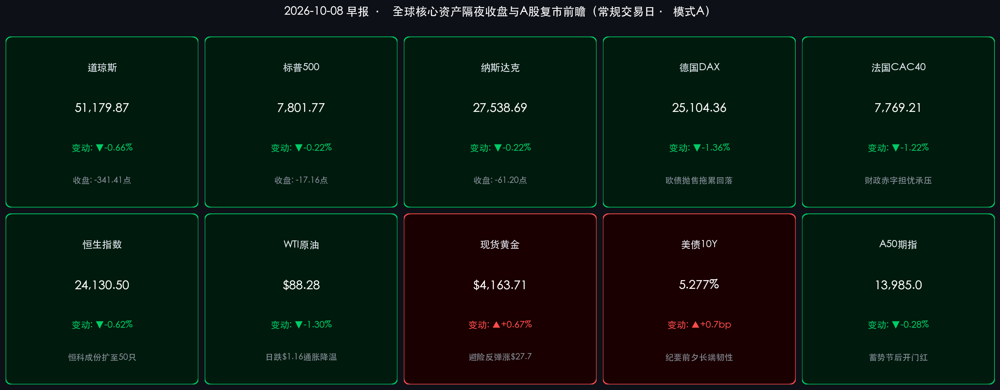

# 🌏 全球金融早报 · 外围高位蓄势整固与A股国庆节后复市开门红前瞻

**日期：2026年10月08日 (星期四)** &nbsp; **时段：早报 (常规交易日 · 模式A)**

> **核心摘要**：隔夜欧美市场在创出历史极值后迎来健康的高位休整，标普500指数微跌 **-0.22%**（收报 **7,801.77点**），纳斯达克综合指数下跌 **-0.22%**（收报 **27,538.69点**），道琼斯工业指数回落逾340点（收报 **51,179.87点**）。市场在美联储9月FOMC会议纪要公布前夕情绪趋于谨慎，10年期美债收益率微升至 **5.277%** 维持高位韧性，国际油价继续下行1.3%至 **$88.28/桶**，避险资金推动现货黄金反弹至 **$4,163.71/盎司**。与此同时，长达7天的国庆中秋黄金周圆满收官，今日（10月8日）A股市场正式复牌开市。中国央行今晨巨额开展1.2万亿元买断式逆回购操作（单日净投放2,000亿元流动性），呵护节后资金面平稳；港股恒生科技指数重磅宣布成份股从30只大幅扩容至50只。中信证券、中金公司与高盛等顶级机构一致认为，历史国庆后首日上涨概率超70%，在外围新高背书、宏观流动性充沛及上市公司三季报披露窗口开启的多重驱动下，A股迎来结构性修复与跨季度布局的绝佳窗口。

---

## 核心行情复盘

*   **美国核心股指（隔夜收盘终值）**：
    *   **标普500指数**：收报 **7,801.77 点**，微跌 **-17.16 点（-0.22%）**，在隔夜突破 7,800 点大关后维持强势横盘休整，成分股呈现良性轮动。
    *   **纳斯达克综合指数**：收报 **27,538.69 点**，下跌 **-61.20 点（-0.22%）**，自历史最高峰小幅获利了结，中长期均线系统多头排列依然完好。
    *   **道琼斯工业指数**：收报 **51,179.87 点**，下跌 **-341.41 点（-0.66%）**，部分周期与工业龙头在高位消化前期连续上涨的技术压力。
*   **领涨领跌行业与异动个股**：
    *   **核心科技权重分化盘整**：**英伟达 (NVDA)** 微调 **-0.74%** 收报 237.47 美元，**特斯拉 (TSLA)** 下跌 **-0.75%** 收报 377.81 美元，**苹果 (AAPL)** 逆势收涨 **+0.91%** 录得 336.67 美元，显示消费电子与端侧硬件链条具备更强防守韧性。
    *   **大宗与能源承压收跌**：受油价日内继续回落影响，国际大型油气公司普遍回调；而金银采选板块受现货黄金反弹带动探底回升。
    *   **软件与防御类资产抗跌**：医疗保健、必需消费与公用事业等高股息防御板块逆市录得资金小幅净流入。
*   **欧洲核心股市（隔夜收盘终值）**：
    *   **德国DAX**：收报 **25,104.36 点**，下跌 **-344.83 点（-1.36%）**，欧洲长期主权债券收益率反弹引发部分高估值工业制造个股估值承压。
    *   **法国CAC 40**：收报 **7,769.21 点**，下跌 **-95.86 点（-1.22%）**，主要受欧洲宏观预算赤字议题与避险情绪抬头影响。
    *   **英国富时100**：收报 **10,458.50 点**，下跌 **-85.75 点（-0.81%）**，金融与出口权重股多数随外围大盘回落。
*   **大宗商品与债券市场**：
    *   **WTI原油期货**：收报 **$88.28/桶**，下跌 **-1.16 美元（-1.30%）**，供给端扰动短期钝化，高位库存释放持续缓解全球通胀担忧。
    *   **现货黄金**：收报 **$4,163.71/盎司**，上涨 **+27.71 美元（+0.67%）**，盘中经历洗盘后在逢低避险资金推动下企稳回升。
    *   **10年期美债收益率**：报 **5.277%**（微升约 **+0.7bp**），市场在美联储公布最新议息纪要前夕维持谨慎中性观望。
*   **亚太与离岸资产最新动向（复市前瞻）**：
    *   **恒生指数（周三收盘）**：收报 **24,130.50 点**，回撤 **-150.06 点（-0.62%）**；恒生指数公司宣布重大编制规则革新，恒生科技指数扩容至50只成份股。
    *   **富时中国A50期指**：最新交投于 **13,985.0 点** 附近，节前避险头寸平稳转换，多头蓄势迎接早间A股集中开盘竞价。
    *   **离岸人民币 (USD/CNH)**：维持在 **6.7081** 平稳区间，汇率预期高度稳定。
    *   **比特币 (BTC)**：交投于 **$83,150** 附近，高位去杠杆清算超4亿美元多单后在8.3万美元关口构建短周期底部。

---

## 核心解读与市场逻辑

> **核心解读一：美股历史极值下的良性获利了结：美联储纪要前夕的“降速过弯”**
> 隔夜欧美股市在连续刷新历史天花板后迎来小幅整固，标普500指数微跌 **-0.22%** 仍牢牢站稳7,800点上方。
> * **逻辑链条**：历史新高积累充沛浮盈（现状） → 叠加FOMC会议纪要即将落地的不确定性（事件） → 驱动短期多头资金在长端美债收益率反弹时进行战术性仓位锁定（逻辑）。
> * **结构特征**：指数虽有微调，但跌幅极其克制，科技龙头英伟达跌幅不足0.8%，苹果逆势创出反弹新高。市场由前期的“单边逼空”转入更加健康的“结构分化”，为四季度业绩驱动期奠定了更为扎实的基础。

> **核心解读二：油价连续下行与黄金韧性反弹：滞胀担忧瓦解与避险对冲并存**
> WTI原油进一步滑落至 **$88.28/桶**，而现货黄金从低位劲升逾27美元至 **$4,163.71/盎司**。
> * **本质拆解**：原油弱势表明工业大宗商品对二次输入型通胀的推动力已彻底钝化，彻底打破了此前困扰央行的加息阴霾；黄金的逆市走强则反映出宏观地缘局部博弈与长周期主权货币多元化配置的长期需求。
> * **资产指引**：能源成本的实质性回落对全球制造业以及中游消费企业的利润率构成中期直接利好，也为各大经济体维持相对宽裕的流动性环境创造了充裕的空间。

> **核心解读三：长假收官迎10月8日A股复市：央行净投放护航与70%胜率历史规律**
> 今日为2026年国庆长假后首个交易日，全社会超21.3亿人次的创纪录人员流动已经印证了内需基本面的韧性。
> * **流动性护航**：央行今日开展1.2万亿元买断式逆回购，单日实现净投放2,000亿元，从资金供给源头彻底打消节后季节性抽水顾虑。
> * **历史规律与博弈窗口**：统计自2016年以来的历史数据，A股在国庆节后首日上涨胜率高达70%。节前由于避险情绪离场的活跃交易资金面临强烈的“补票回流”需求，加上三季报业绩披露窗口即将在10月中旬密集开启，具备扎实景气度与低估值特征的核心资产具备极高的胜率。

---

## 政策脉动

*   **中国央行与财政部节后首日重磅定调**：
    *   中国人民银行今日（10月8日）清晨公告，为保持银行体系流动性合理充裕，开展12,000亿元买断式逆回购操作，当日实现资金净投放2,000亿元，释放出极为明确的呵护开市流动性信号。
    *   财政部相关负责人表示，正加紧研究出台针对性强的一揽子增量财政政策，推动专项债与特别国债资金尽快形成实物工作量，强化对高新技术产业和数字新基建的资本金支持。
*   **美联储货币政策前瞻**：
    *   美联储即将于美东时间周四公布9月FOMC货币政策会议纪要。华尔街主流交易员普遍关注纪要中对于劳动力市场再平衡与降息节奏的措辞，目前利率期货市场对年底前累计降息的基准定价依然维持在45-50个基点之间。
*   **港交所与指数公司编制革新**：
    *   恒生指数公司于10月7日正式发布公告，将恒生科技指数成分股数量由30只大幅提升至50只，并取消特定行业限制、引入双组别选股机制。此举将极大增强科技指数对创新药、先进制造与人工智能端侧产业的涵盖深度，相关改革将于2026年12月指数检讨中正式实施。

---

## 最新机构观点

> **中信证券 (CITIC Securities)**：
> * **国庆节后进入关键进攻窗口，三季报验证重于概念博弈**：海外市场创历史新高后良性整理，外围系统性风险完全出清。节后首日A股大概率迎来风险偏好修复带来的“开门红”，且三季报前后是年内最后一波进攻窗口。
> * **坚定执行“成长进攻 + 红利质量”哑铃配置**：在进攻方向上重点聚焦三季报超预期的 **算力硬件、半导体先进制程及AI终端供应链**；在防守底仓上继续重配 **股息率充沛的商业银行、央国企电力公用事业与交通运输**，兼顾收益弹性与组合抗跌性。

> **中信建投证券 (CSC Financial)**：
> * **节前非理性急跌是短期情绪共振，节后迎来胜率极高的反弹修复**：复盘近十年国庆节后表现，首日上涨概率达到70%，节后首周全市场流动性回升趋势明确。当前A股主要指数估值均处于历史偏低分位数，向下空间已被有效封死。
> * **关注三条高景气主线**：一是受益于消费以旧换新政策与长假消费验证的 **智能家电与新能源汽车链条**；二是具有出海全球竞争力的 **创新药及CXO高端制造**；三是节后增量财政发力重点锚定的 **特高压与电网数字化**。

> **中金公司 (CICC)**：
> * **央行大额净投放夯实资金底，A股有望展开跨季度结构性上攻**：央行节后首日即净投放2,000亿元流动性，展现出极强的宏观逆周期调节定力。外围股市微幅整理无碍中国核心资产估值修复大局。
> * **以业绩驱动为纲**：四季度行情的核心定价逻辑正从前期的流动性与估值驱动转向基本面验证，建议优先配置现金流充沛、在手订单充裕且具备自主可控壁垒的高端装备与芯片制造企业。

> **高盛 (Goldman Sachs)**：
> * **维持中国股票“超配（Overweight）”评级，海外长线资本积极关注复牌机遇**：高盛最新亚太策略报告指出，中国核心资产相对全球主要市场的估值折价依然处于极端水平，向上弹性显著高于下行风险。随着国庆消费数据超预期以及财政增量政策箭在弦上，海外长线对冲基金与主权多资产机构正加大对中国资产的底部配置力度。

---

## 今日市场情绪：金门晨启沧海阔，锦鲤腾渊跃新程

> Prompt: A magnificent oriental jade and bronze gate standing tall amidst early morning mist, slowly opening toward a vast ocean illuminated by golden sunrise. A luminous celestial koi leaping gracefully from the shimmering water, its scales reflecting amber and emerald light. In the background, sleek futuristic skyscrapers and glowing constellation charts ascend into the soft dawn sky.

---

> **免责声明**：内容仅供参考，不构成投资建议。数据来源：investing.com、tradingeconomics.com、各交易所官方发布及权威券商研报，收盘终值截止于2026年10月7日美欧收盘及10月8日早间亚太离岸市场最新数据。
