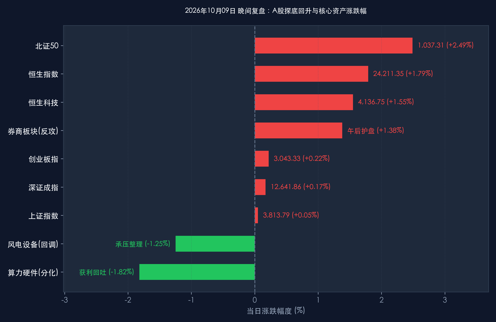

# 2026年10月09日 每日金融市场晚报 (探底回升深V反转·金融科技共振护盘)

**日期：2026年10月09日 (星期五)** &nbsp; **时段：16:30 晚间收盘复盘**

> **核心摘要**：今日A股市场走出极具戏剧性的“深V”大反转走势。早盘受隔夜外围情绪扰动及节后获利盘二次抛压影响，主要指数低开低走，创业板指盘中跌超3%，上证指数一度击穿3,800点整数心理关口。午后增量资金借道沪深300及中证500宽基ETF果断进场抄底，非银金融（券商板块）直线拉升吹响反攻号角，影视传媒、AI应用及固态电池板块全线爆发，带领大盘强势收复失地并集体翻红。截至收盘，上证指数微涨 **+0.05%**（收报 **3,813.79点**），深证成指涨 **+0.17%**（收报 **12,641.86点**），创业板指涨 **+0.22%**（收报 **3,043.33点**），科创50微涨 **+0.07%**（收报 **1,457.27点**），北证50大涨 **+2.49%**。全市场成交额进一步放大至 **1.92万亿元**（较前一交易日放量超2,300亿元），超 **3,200只** 个股飘红。央行系统阐述汇率政策定调“不干预长期趋势”，人民币汇率中间价升值37基点。中信证券、中金公司及中信建投等头部机构指出，盘中探底回升确立了四季度行情的稳固“底座”，估值收缩已近尾声，市场正从情绪博弈有序过渡至基本面与政策共振的健康慢牛格局。

---

## 核心行情复盘

*   **A股核心指数（收盘终值）**：
    *   **上证指数 (000001.SH)**：早盘最低探至3,786点后获得强劲买盘支撑，午后在券商与大金融发力下逐级回升，收报 **3,813.79点**，上涨 **+1.89点 (+0.05%)**，成功收复并站稳3,800点整数关口。
    *   **深证成指 (399001.SZ)**：盘中深跌近2.5%后展现极高弹性，尾盘顺利翻红，收报 **12,641.86点**，上涨 **+20.96点 (+0.17%)**。
    *   **创业板指 (399006.SZ)**：早盘重挫超3%引发恐慌盘出清，午后科技成长与新能源权重带头反攻，收报 **3,043.33点**，上涨 **+6.67点 (+0.22%)**。
    *   **科创50 (000688.SH)**：经受住先进制程分化考验，微幅收涨，收报 **1,457.27点**，上涨 **+0.95点 (+0.07%)**。
    *   **北证50 (899050.BJ)**：创新成长小盘股活力爆发，全天领跑市场，收报 **1,037.31点**，大涨 **+25.21点 (+2.49%)**。
    *   **市场成交与广度**：全天沪深京三市成交金额达 **1.92万亿元**（约19,167亿元），较昨日显著放量逾 **2,300亿元**；全市场超 **3,200只** 个股上涨，赚钱效应在午后呈现“井喷式”扩散，空头动能遭遇多头主力资金集中狙击。
*   **领涨领跌行业与异动板块**：
    *   **领涨反攻板块 (金融突围与AI赋能)**：
        *   **证券与非银金融**：午后成为市场逆转的“中流砥柱”，板块内华鑫股份强势涨停封板，东吴证券、中金公司、中信证券等龙头快速拉升，板块整体大涨 **+1.38%**，有效激活了场外做多资金。
        *   **影视院线、数字媒体与AI应用**：受益于长假消费数据刺激及三季报AI赋能落地，影视传媒板块涨幅居前，多只成分股触及涨停。
        *   **固态电池与锂电产业链**：新能源上游技术迭代预期升温，固态电池概念卷土重来，宁德时代等龙头午后企稳反弹。
        *   **大消费与现代农业**：农业种植、食品饮料及局部零售板块表现抗跌，避险资金与消费复苏预期共振。
    *   **震荡承压板块 (高位硬件与周期分化)**：
        *   **算力硬件与芯片封装**：部分前期涨幅过大的存储芯片、封装及元器件个股日内出现获利回吐，板块全天收跌 **-1.82%**，显现结构性筹码轮动。
        *   **风电设备与部分工业重工**：受外围关税传闻扰动及短期订单节奏影响，风电设备板块下挫 **-1.25%**，资金阶段性流出防御性较差的重工业链条。
*   **港股市场（收盘终值）**：
    *   **恒生指数 (HSI)**：延续节后强势反弹动能，收报 **24,211.35点**，大涨 **+425.56点 (+1.79%)**，突破24,200点技术阻力位。
    *   **恒生科技指数 (HSTECH)**：科网龙头全线爆发，收报 **4,136.75点**，涨幅达 **+1.55%**（盘中涨幅一度超2%），美团、快手、网易及腾讯涨幅均在2%至4%之间。
    *   **南向资金与港股通**：南向资金净流入态势坚挺，继续重点加仓核心互联网大厂与高股息电信股，支撑港股估值修复走在亚太前列。
*   **离岸与跨市场核心指标**：
    *   **富时中国A50期指**：早盘一度跌逾1%，午后随A股现货强劲拉升全面转红，最新收报 **13,852.0点**，上涨 **+36.0点 (+0.25%)**。
    *   **人民币汇率**：中国人民银行授权公布的人民币对美元中间价报 **6.7330**，较前一交易日调升 **37个基点**；离岸人民币（USD/CNH）在6.70至6.73区间维持稳健双向波动，外资配置信心持续增强。

> **核心板块逻辑拆解**：
> 今日的走势是典型的“绝地反击与底部确认”战役。早盘恐慌性抛盘主要来自节后首日高位进场的短线跟风盘在遭遇昨日长阴后的非理性踩踏，上证指数一度失守3,800点关键支撑。然而，在恐慌盘完全释放的关键时点，增量资金并未袖手旁观，不仅宽基ETF出现千亿级买单扫货，券商板块更在午后扮演了“定海神针”角色。成交量放大至1.92万亿表明，在当前估值底部区间，低位买盘的承接能力极强。高位硬件与低位消费/金融的快速切换，标志着市场正在剔除过度杠杆资金，重构更健康、更具韧性的多头防线。

---

## 核心解读与市场逻辑

> **解读一：早盘急跌洗尽浮筹，午后宽基ETF精准抄底构筑“技术双底”**
> 今日盘中三大指数的下探探底并非基本面恶化，而是市场在消化节前暴涨与节后首日震荡后的“二次探底回踩”。值得高度重视的是，早盘上证综指触及3,786点低点后，以沪深300ETF、中证500ETF为代表的国家队与中长线机构资金成交陡增，迅速托举指数回升。这种“早盘恐慌出逃、午后坚定承接”的盘面，在日K线上留下了极长且极具支撑意义的下影线，与昨日的放量长阴构成了教科书级别的洗盘组合，彻底扫清了短线获利浮筹。

> **解读二：券商股午后拔地而起，做多信号旗帜鲜明**
> 证券板块历来是A股行情转向的“先锋军”。午后华鑫股份闪电封板，中金公司、中信证券等龙头跟涨超3%，直接带动了全市场风险偏好由冰点迅速回暖。券商的异动不仅反映出机构投资者对资本市场后续交易量中枢保持在1.5万亿-2万亿元高位水平的坚定信心，更体现了政策面持续推动中长线资金入市、优化投融资环境的制度红利正在被市场逐步定价。

> **解读三：放量至1.92万亿，三季报预热期迎来“真成长”重定价**
> 两市成交额今日再登1.9万亿元台阶，充分证明当前市场流动性依然高度泛滥，资金并未离场，而是在场内积极寻找安全边际更高的优质资产。影视传媒、AI应用端以及固态电池的领涨，说明市场正在从单纯的“题材炒作”和“硬件堆砌”向“三季报业绩可兑现、下游商业化落地”的真成长方向演进。四季度“基本面为锚、流动性托底”的慢牛特征已愈发鲜明。

---

## 政策脉动

*   **中国人民银行 (PBOC)**：
    *   今日在公开市场开展 **20亿元7天期逆回购** 操作，中标利率保持在 **1.40%** 不变。结合前一交易日开展的6,060亿元隔夜逆回购与12,000亿元3个月期买断式逆回购，央行多维协同工具呵护节后资金面效果立竿见影，银行间拆借利率稳中有降，流动性处于“合理充裕”上限。
    *   **重磅定调汇率政策**：央行最新发表重磅政策立场文章，首次全面、系统阐述了人民币汇率政策。明确指出中国坚持以市场供求为基础、参考一篮子货币进行调节、有管理的浮动汇率制度，**“不预设汇率目标水平，不干预汇率长期趋势”**，坚决保持汇率弹性和双向浮动。这一表态极大稳定了外资长期持有中国资产的预期。
*   **中国证监会 (CSRC) 与发改委**：
    *   持续推进一揽子增量政策落地细则，深化中长期资金入市机制改革。鼓励保险资金、社保基金等加大权益投资逆周期配置力度，加快权益类ETF审批与上市节奏。
    *   有关部门正加速督导专项债与超长期特别国债资金流向重大战略项目，强化宏观经济第四季度企稳回升的内生动能。

---

## 最新机构观点

> **中信证券 (CITIC Securities)**：
> * **本轮科技调整属于估值收缩而非盈利下修，无需悲观**：中信证券最新策略报告强调，全球及国内科技股的短期震荡主要是对前期过快估值扩张的技术性修正，而非基本面盈利预期的恶化。
> * **下一轮主升浪启动窗口大概率在四季度中后期**：建议投资者保持震荡市思维，在控制仓位节奏的同时维持乐观耐心。重点关注具备真实订单壁垒的 **半导体设备/材料、AI端侧应用、创新药**，并在回调中逐步建仓低估值蓝筹以平衡组合波动。

> **中金公司 (CICC)**：
> * **外部扰动难掩内生韧性，探底回升夯实四季度行情基础**：中金策略团队指出，早盘恐慌主要是外部因素诱发的交易层面情绪释放，A股午后的深V反转再次印证了3,800点下方的极强估值支撑与政策底盘。
> * **布局“业绩验证+政策共振”主线**：随着三季报进入密集披露期，市场将从概念题材转向业绩兑现。建议沿两条主线布局：一是估值具备绝对安全边际的高股息与大金融板块；二是受益于促内需政策落地且三季度业绩有望超预期的高端制造与智能汽车链。

> **中信建投 (CSC Financial)**：
> * **探底回升确立震荡中枢底部，政策托底效应显现**：中信建投指出，今日两市探底拉升并伴随1.9万亿成交放量，说明宏观基本面平稳、流动性宽松的基本格局没有改变，场外增量资金在关键点位具备极高的进场意愿。
> * **坚定看好慢牛格局展开**：建议投资者逢低布局景气度边际改善的顺周期消费蓝筹与核心成长龙头，紧扣政策指引与企业真实盈利增长。

---

## 今日市场情绪：金凤涅槃穿雾散，券融科技挽澜回

> Prompt: A majestic golden mechanical phoenix rising powerfully from the depths of a misty turbulent canyon into a glowing amber sky, radiating vibrant streaks of warm crimson light. In the background, jagged towering stone pillars carved with ascending glowing chart lines, dispersing storm clouds, and a calm sunlit horizon emerging in the distance.

---

*免责声明：内容仅供参考，不构成投资建议。*
