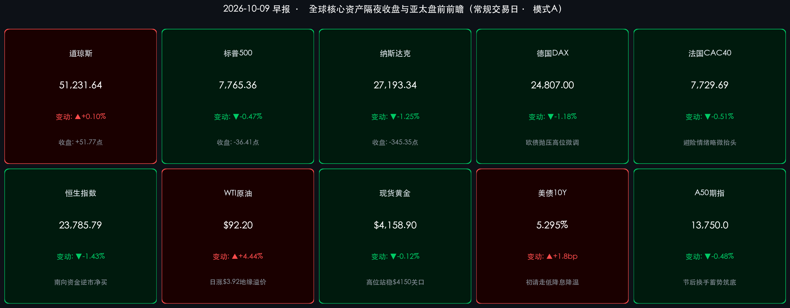

# 🌏 全球金融早报 · 原油暴涨美股科技分化调整与A股洗盘后蓄势前瞻

**日期：2026年10月09日 (星期五)** &nbsp; **时段：早报 (常规交易日 · 模式A)**

> **核心摘要**：隔夜外围市场呈现冰火交织的结构性分化格局。受中东红海地缘危机再起及墨西哥湾飓风扰动美油供给影响，国际油价暴涨 **+4.44%** 突破92美元大关（WTI收报 **$92.20/桶**）；同时美国最新公布的初请失业金人数降至 **19.7万人** 创近期新低，强劲就业数据压制激进降息预期，推动10年期美债收益率反弹至 **5.295%**。美股三大指数出现显著分化：道琼斯指数在能源与价值防守权重支撑下逆市微涨 **+0.10%**（收报 **51,231.64点**），标普500指数下跌 **-0.47%**（收报 **7,765.36点**），纳斯达克综合指数受科技巨头获利回吐拖累下跌 **-1.25%**（收报 **27,193.34点**，英伟达跌近3%）。与此同时，中国A股在节后复市首日放量1.68万亿完成充分换手与“高低切换”大洗盘，大行红利板块夯实价值底线。高盛、摩根士丹利与中金公司等顶级机构一致认为，全球正处于“高利率与强增长”并存的AI资本开支周期，短期外围波动不改基本面韧性，A股在急跌洗盘后估值性价比极其凸显，随着三季报业绩披露期开启，真成长与高股息资产迎来跨季度布局良机。

---

## 核心行情复盘

*   **美国核心股指（隔夜收盘终值）**：
    *   **道琼斯工业指数**：收报 **51,231.64 点**，上涨 **+51.77 点（+0.10%）**，受传统能源与金融权重逆势走强拉动，大盘蓝筹呈现出较强抗跌性。
    *   **标普500指数**：收报 **7,765.36 点**，下跌 **-36.41 点（-0.47%）**，自高位连续第二日技术性整固，成分股涨跌互现，资金由成长转向价值。
    *   **纳斯达克综合指数**：收报 **27,193.34 点**，下跌 **-345.35 点（-1.25%）**，长端美债收益率反弹压制高估值科技板块，半导体及AI链条出现集中获利了结。
*   **领涨领跌行业与异动个股**：
    *   **半导体与AI算力深度调整**：**英伟达 (NVDA)** 大跌 **-2.99%** 收报 230.38 美元，市场对AI商业化变现节奏及OpenAI收入预期展开热议；博通、AMD等核心算力龙头多数回调 2% 至 3.5%。
    *   **消费电子逆势显韧性**：**苹果 (AAPL)** 逆势收涨 **+1.11%** 报 340.42 美元，端侧AI硬件生态与健康充沛的自由现金流展现出极强防御属性；**特斯拉 (TSLA)** 微跌 **-0.74%** 收报 375.00 美元。
    *   **传统能源与公用事业领涨**：受原油暴涨超4.4%推动，埃克森美孚、雪佛龙等能源巨头大幅领涨标普500板块，公用事业与大金融板块亦录得资金避险净流入。
*   **欧洲核心股市（隔夜收盘终值）**：
    *   **德国DAX**：收报 **24,807.00 点**，下跌 **-297.36 点（-1.18%）**，欧债长端收益率同步走高对高端制造类权重估值形成抑制。
    *   **法国CAC 40**：收报 **7,729.69 点**，下跌 **-39.52 点（-0.51%）**，受欧洲宏观预算赤字及消费降温担忧影响维持低位震荡。
    *   **英国富时100**：收报 **10,441.60 点**，微跌 **-16.90 点（-0.16%）**，壳牌、BP等石油巨头飙升大幅对冲了大盘回调压力。
*   **大宗商品与债券市场**：
    *   **WTI原油期货**：收报 **$92.20/桶**，暴涨 **+3.92 美元（+4.44%）**，红海地缘冲突加剧与墨西哥湾油气生产受飓风侵袭造成供给端突发收缩，油价创阶段反弹新高。
    *   **现货黄金**：收报 **$4,158.90/盎司**，微跌 **-4.81 美元（-0.12%）**，虽然美元走强形成扰动，但地缘避险买盘依然支撑金价稳守 4,150 美元上方高位平台。
    *   **10年期美债收益率**：报 **5.295%**（上涨约 **+1.8bp**，盘中最高冲至 5.31%），因美国强劲就业数据引发降息预期边际降温。
*   **亚太与离岸资产最新动向（盘前前瞻）**：
    *   **恒生指数（周四收盘）**：收报 **23,785.79 点**，下跌 **-344.71 点（-1.43%）**；恒生科技指数收报 4,194.49 点微跌 -0.68% 表现抗跌；南向港股通资金恢复交易后录得积极净申购，主要流向互联网平台及低估值央企。
    *   **富时中国A50期指**：最新交投于 **13,750.0 点** 附近，在节后首日完成高低切换消化后逐步构筑企稳防线。
    *   **离岸人民币 (USD/CNH)**：报 **6.7035**，人民币对美元汇率保持在6.70关口附近坚挺平稳。
    *   **比特币 (BTC)**：交投于 **$81,500** 附近，连续四日走弱释放杠杆多单，在 81,000 美元整数关口寻获初步技术买盘支撑。

---

## 核心解读与市场逻辑

> **核心解读一：原油暴涨叠加火爆就业，美债收益率反弹重塑短期资产定价锚**
> 隔夜海外宏观变量出现显著波动：一方面红海袭击与墨西哥湾飓风共振推升 WTI 原油突破 92 美元，另一方面美国当周初请失业金人数降至 19.7 万人（低于前值 19.9 万），显示美国就业底色极为坚实。
> * **传导逻辑**：强劲就业数据削弱了美联储后续激进宽松的紧迫性（事件） → 推动 10 年期美债收益率攀升至 5.295%（数据） → 进而对近期处于历史极值的高估值科技成长资产带来无风险贴现率的直接打压（逻辑）。
> * **市场影响**：前期高歌猛进的纳斯达克迎来获利兑现，而低市盈率、高股息的能源与传统价值标的受到避险资金青睐，全球资产由“估值扩张”转向“高低轮动”。

> **核心解读二：美股内部极致高低切换，科技获利回吐与价值防守分道扬镳**
> 隔夜盘面道琼斯指数逆市收红，而纳斯达克指数回撤达 1.25%，英伟达跌近 3% 与苹果逆市上涨 1.11% 形成鲜明对照。
> * **结构拆解**：这一分化并不意味着牛市终结，而是资本面对再通胀风险与利率波动的理性重构。能源巨头受益于油价飙升成为吸金主力，以苹果为代表的拥有巨额现金流和端侧壁垒的消费电子显现硬核抗跌性。
> * **中长期定力**：正如高盛与大摩所强调的，全球超大规模科技企业的真实资本开支扩张尚未见顶，短期的估值消化反而为四季度业绩驱动行情的良性展开腾挪出了空间。

> **核心解读三：A股节后首日1.68万亿大洗盘，高低切换完成健康筹码换手**
> 节后首日（10月8日）A股呈现冲高回落的长阴线走势，两市成交额跃升至 1.68 万亿元，科技题材调整而大型银行股逆市创新高。
> * **洗盘本质**：这一走势并非资金恐慌离场，而是节前暴利盘在假期利好落地后的获利套现，与节前踏空资金在低位进场的充分换手。历史统计显示，冲高回落的洗盘能极快消化节后浮筹，使市场重归理性。
> * **前瞻布局**：伴随大行红利奠定坚实估值底，市场风险偏好正转向业绩确定性。随着10月中旬上市公司三季报披露大幕拉开，经过充分洗盘的高端装备、自主可控半导体及出海高景气龙头标的将迎来胜率极高的“二次进场买点”。

---

## 政策脉动

*   **美国劳工部与美联储最新政策信号**：
    *   美国劳工部公布截至10月3日当周初请失业金人数为 19.7 万人，好于市场预期，反映美国劳动力市场韧性强劲，基本排除了短期陷入衰退的风险。
    *   美联储公布的9月货币政策会议纪要显示，多数委员认为在通胀彻底回落至2%目标前仍需保持适度限制性利率水平，未来政策调整将完全取决于数据走向，抑制了华尔街盲目押注超常规降息的预期。
*   **中东地缘局势与国际能源供给扰动**：
    *   红海航道周边紧张局势升级，胡塞武装针对货轮与油轮的新一轮袭击加剧了全球原油海运供应链的中断风险；同时，墨西哥湾油气作业平台受热带风暴与飓风影响出现阶段性关停减产，共同推高原油地缘风险溢价。
*   **中国宏观流动性定力与增量财政发力**：
    *   中国人民银行在节后连续开展大规模公开市场操作，继首日净投放2,000亿元流动性后，继续保持银行间流动性合理充裕，坚决平抑节后资金利率波动，引导社会综合融资成本稳中有降。
    *   国家发改委与财政部联合强调，将加快落实一揽子增量政策落地细则，确保超长期特别国债与地方政府专项债券资金在四季度尽快形成实物工作量，重点倾斜于数字新基建、关键核心技术突破及重大水利能源管网建设。
    *   证监会继续推进中长期资金入市实施机制，进一步完善上市公司市值管理指引，推动险资、社保与公募基金加大对核心资产的中长期配置比重。

---

## 最新机构观点

> **高盛 (Goldman Sachs)**：
> * **全球处于强劲AI资本开支脉冲期，维持股票资产“超配”评级**：高盛最新宏观策略报告强调，全球经济基本面保持高度韧性，三季度美国GDP跟踪增速达3.4%，中国达4.0%。数万亿美元规模的企业AI基础设施与主权AI资本开支正形成强大的周期性推动力。
> * **短期利率颠簸无碍中长期牛市**：尽管美债长端利率短期随就业数据走强而反弹，给高估值科技股带来价格重估压力，但全球科技龙头的盈利复合增速依然稳固，建议投资者在科技板块技术性回调中寻找企业AI基础设施与算力硬件龙头的加仓机遇。

> **摩根士丹利 (Morgan Stanley)**：
> * **“高利率与强增长”格局确立，回调为周期与资本品提供极佳入场点**：大摩首席股票策略师迈克尔·威尔逊（Michael Wilson）在《The BEAT》研报中指出，当前市场呈现典型的“Rates Are Up, Growth Is Strong”特征，大厂强劲的自由现金流正在将红利扩散至制造业与传统经济板块。
> * **资产配置建议偏向股票**：当前美股估值回落有效释放了夏季以来美债利率上行积累的估值压力，建议投资者精选资本品（Capital Goods）、高端装备以及具备全球竞争优势的优质工业制造龙头。

> **中金公司 (CICC)**：
> * **10月中旬步入全球与国内资产“双重验证期”，以高股息奠定安全垫**：中金策略团队指出，海外市场受地缘油价与美债利率扰动加大，而国内市场在节后首日放量洗盘后步入震荡筑底期。当前A股主要宽基指数估值仍处历史中低分位，下行空间已被坚实的政策底封死。
> * **布局业绩拐点与自主可控**：在外部扰动与三季报披露交织的窗口期，建议继续采取“哑铃型配置”：一方面以大型商业银行、公用事业等低估值高股息资产作为底仓压舱石；另一方面逢低积极布局在手订单充沛、具备自主可控硬实力的先进封装、半导体设备及高端出海制造龙头。

---

## 今日市场情绪：金秤量波澜，暗涌见定力

> Prompt: A massive celestial brass balance scale towering over a turbulent neon-lit ocean, with glowing amber energy pouring into one pan from an offshore refinery. On the opposite pan, a luminescent emerald quantum processor shines with serene resilience. In the background, futuristic coastal skyscrapers, giant holographic charts, and rotating storm clouds illuminated by purple lightning.

---

> **免责声明**：内容仅供参考，不构成投资建议。数据来源：investing.com、tradingeconomics.com、各交易所官方发布及权威券商研报，收盘终值截止于2026年10月8日美欧收盘及10月9日早间亚太离岸市场最新数据。
