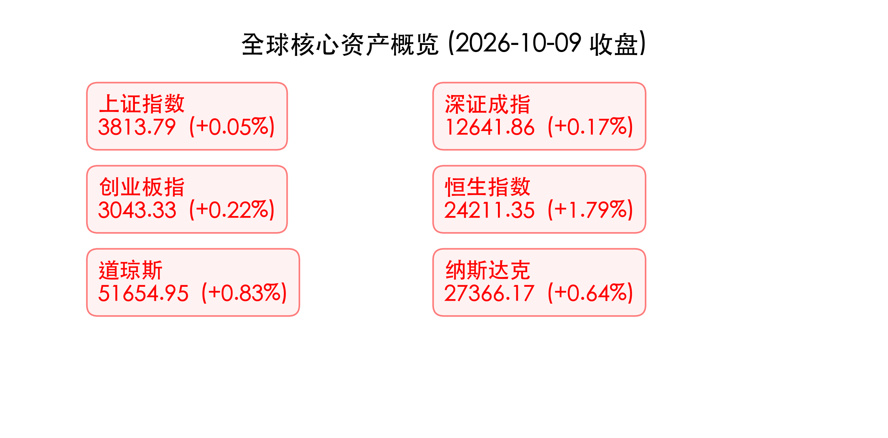

# 2026年10月国庆节后首周市场总结与展望

**日期：2026年10月10日 (星期六)** &nbsp; **时段：晚间/周末复盘**

> **核心摘要**：国庆节后首周（仅2个交易日），A股市场经历“探底回升”的深V反弹，上证指数周跌幅收窄至0.74%；美联储在强劲非农与通胀黏性双重压力下，10月降息预期基本落空，全球市场正从“AI驱动”转向“滞胀博弈”。

## 核心资产周度/日度表现回顾
*   **上证指数**：**3813.79** (周五单日 **+0.05%**，全周累计 **-0.74%**)
*   **深证成指**：**12641.86** (周五单日 **+0.17%**)
*   **创业板指**：**3043.33** (周五单日 **+0.22%**)
*   **恒生指数**：**24211.35** (周五单日 **+1.79%**)
*   **道琼斯工业指数**：**51654.95** (周五单日 **+0.83%**)
*   **纳斯达克指数**：**27366.17** (周五单日 **+0.64%**)

> **核心解读**：节后A股首周仅两个交易日，市场在周五呈现出显著的“V型反转”。早盘科技股回调引发大幅下探，午后资金大规模抄底入场，两市成交额重回 **1.92万亿元**。传媒、AI应用端领涨，而前期火热的算力硬件、半导体短期承压，呈现出明显的结构性高低切换。

## 过去 48 小时重磅事件深度复盘
*   **美联储降息预期骤降**：9月美国非农数据偏弱（新增2.9万），但核心通胀水平居高不下，叠加中东局势推升能源价格。市场普遍预计美联储将在10月底会议上“按兵不动”，年内降息空间被大幅压缩。
*   **A股三季报窗口开启**：随着10月中旬临近，A股进入三季报密集披露期。市场炒作主线正由纯粹的“情绪驱动”向“基本面业绩驱动”过渡。

## 下周全球宏观大事预警
*   **美国核心通胀数据与零售销售**：通胀数据将直接决定美联储年底是否还有最后一次加息动作。
*   **国内LPR报价与经济数据**：关注央行在节后的流动性呵护操作及实体经济融资需求改善情况。

## 顶级机构周末策略内参摘要
> **高盛（Goldman Sachs）**：全球市场正面临“AI信仰”与“通胀粘性”的双重考验，预计美联储政策将长期偏紧。中概股近期的强劲表现（纳斯达克中国金龙指数大涨2.69%）暗示外资对中国资产的底部配置意愿回暖。

> **中信证券**：A股短期“探底回升”表明节前累计的风险释放较为充分。建议采取“哑铃型”策略，左手高股息防守，右手布局三季报超预期的优质成长股，重点关注AI产业链端能否兑现利润。

## 今日市场情绪：深V涅槃，绝处逢生

> Prompt: A giant glowing red phoenix made of candlestick charts rising from a stormy sea. In the background, dark clouds are parting to reveal a bright sun. A human trader (real person) standing on a cliff watching the majestic scene.

免责声明：内容仅供参考，不构成投资建议。
