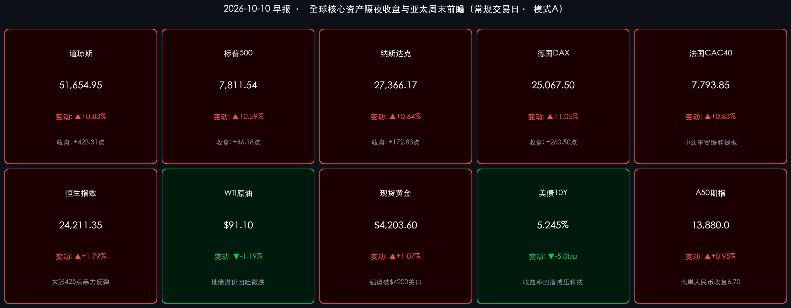

# 🌏 全球金融早报 · 美股全线反弹黄金破4200大关，中概港股共振回暖迎业绩验证期

**日期：2026年10月10日 (星期六)** &nbsp; **时段：早报 (常规交易日 · 模式A)**

> **核心摘要**：隔夜全球资本市场迎来风险偏好显著修复。一方面，中东地缘政治紧张局势边际缓和推动国际原油价格回吐前期部分暴涨溢价（WTI原油微跌至 **$91.10/桶**），同时美债10年期收益率由高位回落5.0bp至 **5.245%**，有效减轻了高估值资产的无风险贴现率压力；另一方面，OpenAI年度营收数据口径差异得到及时澄清，且其计划以1.4万亿美元估值展开新一轮300亿美元融资，有力扫除了短期对AI需求降温的虚假担忧。美股三大指数全线反弹收高：道琼斯指数收涨 **+0.83%**（报 **51,654.95点**，大涨超423点），标普500指数收涨 **+0.59%**（报 **7,811.54点**），纳斯达克综合指数反弹 **+0.64%**（报 **27,366.17点**）；避险与宽松预期重估助推现货黄金强势冲破4200美元历史关口（收报 **$4,203.60/盎司**，大涨 **+1.07%**）。与此同时，亚太与离岸资产强势共振：香港恒生指数周五收涨 **+1.79%** 报收 **24,211.35点**，A股探底回升收红，富时中国A50期指夜盘走高 **+0.95%**，离岸人民币汇率升破6.70关口至 **6.6980**。高盛、摩根士丹利及中金中信等顶级机构一致指出，全球资产已逐步消化地缘油价颠簸，随着下周三季报披露季正式揭幕，“科技进攻+红利防御”的哑铃型配置处于极高胜率窗口。

---

## 核心行情复盘

*   **美国核心股指（隔夜收盘终值）**：
    *   **道琼斯工业指数**：收报 **51,654.95 点**，上涨 **+423.31 点（+0.83%）**，在大金融、工业制造及传统价值蓝筹板块齐涨带动下，道指全日高位震荡，创出历史新高表现。
    *   **标普500指数**：收报 **7,811.54 点**，上涨 **+46.18 点（+0.59%）**，十一大行业板块中有九个录得上涨，市场广度显著改善，成长与价值呈现均衡走强态势。
    *   **纳斯达克综合指数**：收报 **27,366.17 点**，上涨 **+172.83 点（+0.64%）**，长端美债收益率自高位回落，高估值科技板块重新获得买盘支撑，半导体与AI链条在技术性探底后全面企稳。
*   **领涨领跌行业与异动个股**：
    *   **科技巨头与AI硬件链条企稳反弹**：**英伟达 (NVDA)** 止跌回升，市值稳守 5.7 万亿美元上方，仍是各大零售与机构平台资金净买入最集中的龙头；**Palantir (PLTR)** 获高盛上调评级至“买入”，主权AI与企业落地订单强劲；博通、AMD及超微电脑等算力硬件板块均呈现低位买盘承接。
    *   **消费电子与整车标的表现稳健**：**苹果 (AAPL)** 与 **特斯拉 (TSLA)** 股价低位反弹，资金持续流入具备高现金流与AI落地生态的超级巨头；中欧就混合动力汽车贸易达成阶段性缓和谅解，推动全球整车板块普遍回暖。
    *   **能源板块高位回吐**：随着油价从高位轻微回调，埃克森美孚、雪佛龙等传统能源板块结束连续飙升，小幅获利了结；而金融、公用事业及消费板块录得稳健净流入。
*   **欧洲核心股市（隔夜收盘终值）**：
    *   **德国DAX**：收报 **25,067.50 点**，上涨 **+260.50 点（+1.05%）**，油价回落舒缓通胀焦虑，加之中欧车贸关系出现阶段性和解信号，高端汽车制造权重板块领衔大盘突破25000点整数关口。
    *   **法国CAC 40**：收报 **7,793.85 点**，上涨 **+64.16 点（+0.83%）**，奢侈品消费巨头与工业权重股普遍回暖，市场避险情绪显著降温。
    *   **英国富时100**：收报 **10,552.05 点**，上涨 **+110.45 点（+1.06%）**，非必需消费与金融权重发力，有效对冲了能源权重板块的温和回调。
*   **大宗商品与债券市场**：
    *   **WTI原油期货**：收报 **$91.10/桶**，微跌 **-1.10 美元（-1.19%）**，美国针对中东冲突释出阶段性降温信号，叠加飓风对墨西哥湾产量冲击逐步得到控制，原油地缘溢价有所收窄。
    *   **现货黄金**：收报 **$4,203.60/盎司**，大涨 **+44.70 美元（+1.07%）**，强势突破 4,200 美元整数大关，美元指数高位回撤叠加全球央行持续买盘，推动金价再创历史性里程碑。
    *   **10年期美债收益率**：报 **5.245%**（较前一交易日下行 **-5.0bp**），从周内 5.36% 的高点回撤，市场等待下周美国最新 CPI 与 PPI 数据指引。
*   **亚太与离岸资产最新动向（周末前瞻）**：
    *   **恒生指数（周五收盘）**：收报 **24,211.35 点**，大涨 **+425.56 点（+1.79%）**；恒生科技指数大涨近 2.3%，大型互联网平台及科技硬件板块领涨，南向港股通资金持续大额净买入。
    *   **富时中国A50期指**：最新交投于 **13,880.0 点**，夜盘反弹 **+0.95%**，表明离岸多头在消化节后震荡后信心迅速重建。
    *   **离岸人民币 (USD/CNH)**：报 **6.6980**，人民币汇率成功收复 6.70 关口，展现出充沛的宏观外汇抗风险韧性。
    *   **比特币 (BTC)**：交投于 **$83,200** 附近，从周初探底的 81,000 美元低位稳步反弹，加密市场跟随全球风险偏好同步回温。

---

## 核心解读与市场逻辑

> **核心解读一：油价降温叠加美债收益率回落，全球无风险贴现率压力缓解带动科技反扑**
> 隔夜海外宏观环境呈现关键转机：一方面，美国对中东局势的表态缓解了短线霍尔木兹海峡全面封锁的极端悲观预期，WTI 原油回落至 91.10 美元/桶；另一方面，10年期美债收益率顺势从 5.295% 下降 5.0bp 至 5.245%。
> * **传导逻辑**：地缘溢价退潮与油价回调（事件） → 压低通胀再度恶化的短线预期，推升美债价格并引导收益率下行（数据） → 科技与成长资产所面临的分母端折现率压制迅速解除，空头平仓与抄底资金合流（逻辑）。
> * **市场影响**：前期承压的纳斯达克与欧股成长板块全面回血，美股市场广度大幅拓宽，恐慌情绪退潮使得全球资金从单一避险重新流向优质风险资产。

> **核心解读二：OpenAI营收误读消除与融资预期升温，AI资本开支叙事重回正轨**
> 周中部分媒体因会计口径差异（Anthropic 包含云合作伙伴总销售额，而 OpenAI 仅核算净分成），对 OpenAI 约 500 亿美元的年化净营收产生短线误读并触发科技股技术抛压。隔夜市场彻底澄清了该口径差异，并确认 OpenAI 仍保持在 2026 年底达到或突破 700 亿美元年化营收的强劲目标，同时正以 1.4 万亿美元估值推进新一轮 300 亿美元融资。
> * **结构拆解**：这一反转重塑了华尔街对“AI变现速度”的信心。企业端客户对大型模型与算力部署的需求并未放缓，反而随着主权AI生态与端侧智能应用的推广而呈现加速爆发态势。
> * **估值定力**：正如高盛研报所强调的，在算力基础设施与企业应用端，业绩兑现度最高的标的（如英伟达、Palantir 及先进封装链条）依然享有强劲的自由现金流支撑，技术性回踩恰好提供了四季度最具性价比的配置买点。

> **核心解读三：中概港股共振大反弹，A股节后第二日探底回升夯实双底支撑**
> 在经历节后首日的放量大洗盘后，周五（10月9日）A股与港股展现出极其硬核的抗跌性与韧性。港股恒生指数暴力拉升 425 点（+1.79%），A股上证指数在盘中一度下挫 1.5% 的极端不利开局下，午后多头大举进场强势翻红收报 3,813.79 点。
> * **洗盘与换手**：节前踏空资金在周五盘中低点积极承接，节后获利抛盘被彻底消化。两市成交连续维持在超万亿元高位，富时A50期指夜盘进一步冲高至 13,880 点，离岸人民币升破 6.70 关口，清晰印证外资与长线中资正在加速回流中国核心资产。
> * **前瞻布局**：伴随国内一揽子财政与货币增量政策持续发力，下周起上市公司三季报披露窗口正式开启。市场正由情绪脉冲转向基本面与盈利驱动，科技硬核自主可控与大金融红利底仓的“双主线”格局将愈发坚固。

---

## 政策脉动

*   **海外宏观政策预期与美联储信号**：
    *   美联储官员在最新讲话中重申，当前限制性货币政策有效维持了对通胀的压制，在劳动力市场保持坚挺的背景下，降息路径将严格保持“以数据为导向”的灵活节奏。华尔街市场重点聚焦下周即将出炉的最新 CPI 与 PPI 通胀报告，普遍预计核心通胀环比将保持温和走势。
*   **中东地缘局势与国际贸易缓和**：
    *   美国官方表态降低了近期发生突发重大军事打击的中东地缘溢价，波斯湾航道维持常态化通航，国际原油供给中断的极端恐慌逐步降温。
    *   在国际经贸领域，欧盟与中国就混合动力汽车贸易摩擦取得阶段性磋商成果，双方同意建立定期协调机制避免无序关税壁垒，为全球汽车供应链与跨境高端制造注入强心针。
*   **中国增量宏观政策落实与流动性呵护**：
    *   中国人民银行继续实施灵活精准的公开市场操作，持续向银行体系注入合理充裕的流动性，有力呵护节后资金面平稳跨月跨季。
    *   国家发展改革委、财政部多部委密集发布一揽子增量政策落地细则，针对地方专项债发行、超长期特别国债资金下达加快推进，力保在第四季度形成显著的有效投资与实物工作量。
    *   证监会进一步强化上市公司分红回报与市值管理导向，大力引导社保、年金、险资等中长期资金加大对A股与H股核心蓝筹资产的配置比重，筑牢资本市场中长期稳定基石。

---

## 最新机构观点

> **高盛 (Goldman Sachs)**：
> * **维持全球股票“超配”建议，坚定看好主权AI与企业算力基础设施**：高盛全球投资研究部在最新策略报告中指出，尽管美债收益率保持在 5.2% 以上的高位，但强劲的企业盈利增长能够提供充裕的估值缓冲。由于全球主权AI及企业级大模型应用加速落地，上调 Palantir 等关键AI标的评级至“买入”。
> * **亚洲与中国资产重估窗口打开**：高盛在香港举行的亚洲领袖年会上指出，中国半导体及人工智能生态的自主研发步伐快于市场预期，伴随稳增长政策效应传导，中国核心股票资产在当前低估值水平下极具吸引力。

> **摩根士丹利 (Morgan Stanley)**：
> * **高利率环境下盈利质量为王，精选具备充沛现金流的领军企业**：大摩最新研报提示，随着下周美股三季报正式披露，市场焦点将迅速从宏观利率噪音转向微观资产负债表健康度。大型金融机构与具备定价权的工业制造龙头有望在复杂宏观环境中交出超预期答卷。
> * **看好全球供应链改善中的周期品与资本品**：原油价格回落与中欧经贸摩擦边际缓和改善了跨国企业的营商预期，建议逢低配置具备全球竞争壁垒的高端装备与全球供应链关键节点企业。

> **中信证券 (CITIC Securities) & 中金公司 (CICC)**：
> * **节后大洗盘基本结束，四季度开启业绩驱动修复行情**：中信证券与中金公司策略团队一致认为，节后前两个交易日巨量换手已充分消化了浮筹与获利了结压力。沪指在 3,800 点关口展现出极强支撑，A股基本面底与政策底高度共振。
> * **坚守“哑铃型”配置策略**：建议投资者摒弃追涨杀跌，把握“科技进攻+红利防御”的双主线：在进攻端，聚焦三季报业绩确定性极高的AI硬件算力、半导体自主可控设备以及出海高景气制造业；在防守端，以高股息率、估值处于绝对低位的大型商业银行与公用事业龙头作为底仓压舱石。

---

## 今日市场情绪：金衡平澜，机械星盘照引科技新生

> Prompt: A giant celestial mechanical clockwork astrolabe floating over a futuristic metropolis neon harbor, with glowing golden gears interlocking with flowing fiber optic rivers. High in the sky, dual holographic constellations representing an emerald bull and a golden scale illuminate the calm ocean waters. In the background, crystalline skyscrapers adorned with luminous financial tickers and soft nebula clouds.

---

> **免责声明**：内容仅供参考，不构成投资建议。数据来源：investing.com、tradingeconomics.com、各交易所官方发布及权威券商研报，收盘终值截止于2026年10月9日美欧收盘及10月10日早间亚太离岸市场最新数据。

🤖 生成模型：Gemini 3.8 Flash (High) <!-- model-stamp -->
